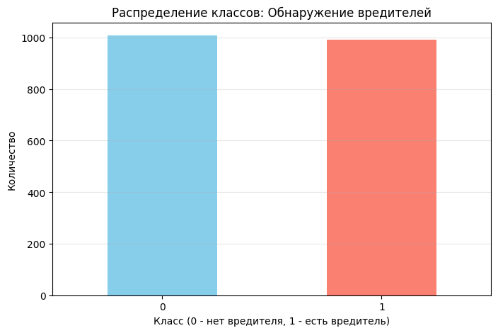
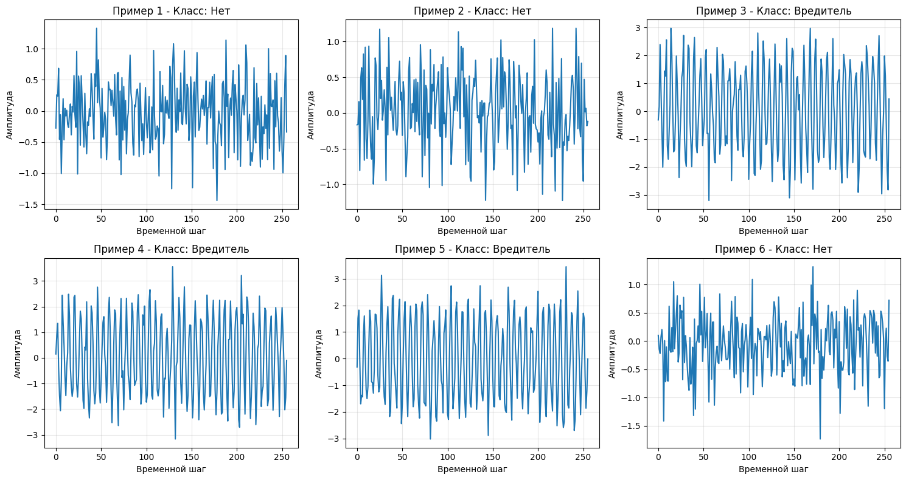
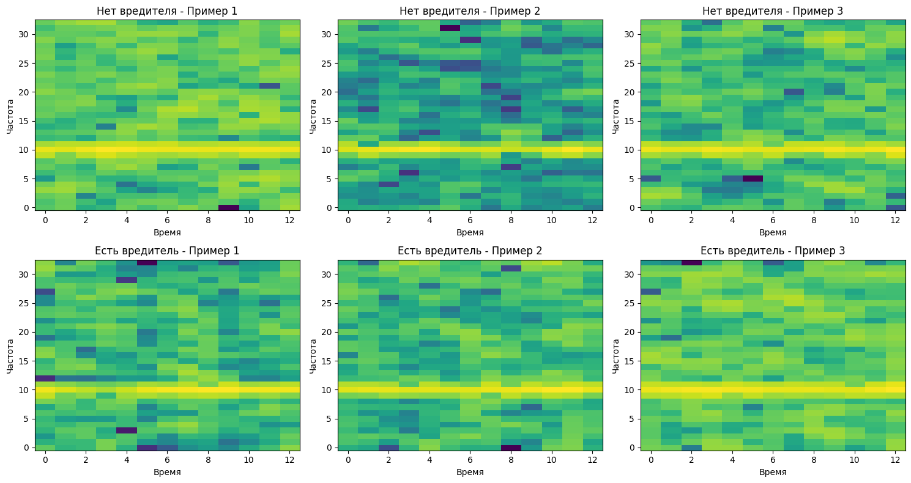

# Обнаружение вредителей по аудио-сигналам

## Задача: Бинарная классификация (есть вредитель / нет)

### Модели:
- 1D-CNN для обработки raw-сигналов
- Transformer для временных рядов

### Требования:
- Применение спектрограмм или raw-сигналов
- Кросс-валидация
- Обоснование выбора архитектуры

## 1. Импорт библиотек


```python
import numpy as np
import pandas as pd
import matplotlib.pyplot as plt
import seaborn as sns
from sklearn.model_selection import StratifiedKFold, train_test_split
from sklearn.metrics import (accuracy_score, precision_score, recall_score, 
                             f1_score, roc_auc_score, confusion_matrix, 
                             classification_report, roc_curve)
from sklearn.preprocessing import StandardScaler
import tensorflow as tf
from tensorflow import keras
from tensorflow.keras import layers, Model
from tensorflow.keras.callbacks import EarlyStopping, ReduceLROnPlateau
import warnings
warnings.filterwarnings('ignore')

# Установка seed для воспроизводимости
np.random.seed(42)
tf.random.set_seed(42)

print(f"TensorFlow version: {tf.__version__}")
```

    TensorFlow version: 2.20.0
    

## 2. Загрузка и анализ данных


```python
# Загрузка данных
df = pd.read_csv('../data/raw/pest_audio_detection_dataset.csv')

print(f"Размер датасета: {df.shape}")
print(f"\nКолонки: {df.columns.tolist()}")
print(f"\nПервые 5 строк:")
df.head()
```

    Размер датасета: (2000, 261)
    
    Колонки: ['sample_id', 'spectral_centroid', 'spectral_energy', 'zero_crossing_rate', 'label_pest_present', 'signal_0', 'signal_1', 'signal_2', 'signal_3', 'signal_4', 'signal_5', 'signal_6', 'signal_7', 'signal_8', 'signal_9', 'signal_10', 'signal_11', 'signal_12', 'signal_13', 'signal_14', 'signal_15', 'signal_16', 'signal_17', 'signal_18', 'signal_19', 'signal_20', 'signal_21', 'signal_22', 'signal_23', 'signal_24', 'signal_25', 'signal_26', 'signal_27', 'signal_28', 'signal_29', 'signal_30', 'signal_31', 'signal_32', 'signal_33', 'signal_34', 'signal_35', 'signal_36', 'signal_37', 'signal_38', 'signal_39', 'signal_40', 'signal_41', 'signal_42', 'signal_43', 'signal_44', 'signal_45', 'signal_46', 'signal_47', 'signal_48', 'signal_49', 'signal_50', 'signal_51', 'signal_52', 'signal_53', 'signal_54', 'signal_55', 'signal_56', 'signal_57', 'signal_58', 'signal_59', 'signal_60', 'signal_61', 'signal_62', 'signal_63', 'signal_64', 'signal_65', 'signal_66', 'signal_67', 'signal_68', 'signal_69', 'signal_70', 'signal_71', 'signal_72', 'signal_73', 'signal_74', 'signal_75', 'signal_76', 'signal_77', 'signal_78', 'signal_79', 'signal_80', 'signal_81', 'signal_82', 'signal_83', 'signal_84', 'signal_85', 'signal_86', 'signal_87', 'signal_88', 'signal_89', 'signal_90', 'signal_91', 'signal_92', 'signal_93', 'signal_94', 'signal_95', 'signal_96', 'signal_97', 'signal_98', 'signal_99', 'signal_100', 'signal_101', 'signal_102', 'signal_103', 'signal_104', 'signal_105', 'signal_106', 'signal_107', 'signal_108', 'signal_109', 'signal_110', 'signal_111', 'signal_112', 'signal_113', 'signal_114', 'signal_115', 'signal_116', 'signal_117', 'signal_118', 'signal_119', 'signal_120', 'signal_121', 'signal_122', 'signal_123', 'signal_124', 'signal_125', 'signal_126', 'signal_127', 'signal_128', 'signal_129', 'signal_130', 'signal_131', 'signal_132', 'signal_133', 'signal_134', 'signal_135', 'signal_136', 'signal_137', 'signal_138', 'signal_139', 'signal_140', 'signal_141', 'signal_142', 'signal_143', 'signal_144', 'signal_145', 'signal_146', 'signal_147', 'signal_148', 'signal_149', 'signal_150', 'signal_151', 'signal_152', 'signal_153', 'signal_154', 'signal_155', 'signal_156', 'signal_157', 'signal_158', 'signal_159', 'signal_160', 'signal_161', 'signal_162', 'signal_163', 'signal_164', 'signal_165', 'signal_166', 'signal_167', 'signal_168', 'signal_169', 'signal_170', 'signal_171', 'signal_172', 'signal_173', 'signal_174', 'signal_175', 'signal_176', 'signal_177', 'signal_178', 'signal_179', 'signal_180', 'signal_181', 'signal_182', 'signal_183', 'signal_184', 'signal_185', 'signal_186', 'signal_187', 'signal_188', 'signal_189', 'signal_190', 'signal_191', 'signal_192', 'signal_193', 'signal_194', 'signal_195', 'signal_196', 'signal_197', 'signal_198', 'signal_199', 'signal_200', 'signal_201', 'signal_202', 'signal_203', 'signal_204', 'signal_205', 'signal_206', 'signal_207', 'signal_208', 'signal_209', 'signal_210', 'signal_211', 'signal_212', 'signal_213', 'signal_214', 'signal_215', 'signal_216', 'signal_217', 'signal_218', 'signal_219', 'signal_220', 'signal_221', 'signal_222', 'signal_223', 'signal_224', 'signal_225', 'signal_226', 'signal_227', 'signal_228', 'signal_229', 'signal_230', 'signal_231', 'signal_232', 'signal_233', 'signal_234', 'signal_235', 'signal_236', 'signal_237', 'signal_238', 'signal_239', 'signal_240', 'signal_241', 'signal_242', 'signal_243', 'signal_244', 'signal_245', 'signal_246', 'signal_247', 'signal_248', 'signal_249', 'signal_250', 'signal_251', 'signal_252', 'signal_253', 'signal_254', 'signal_255']
    
    Первые 5 строк:
    


<div>
<style scoped>
    .dataframe tbody tr th:only-of-type {
        vertical-align: middle;
    }

    .dataframe tbody tr th {
        vertical-align: top;
    }

    .dataframe thead th {
        text-align: right;
    }
</style>
<table border="1" class="dataframe">
  <thead>
    <tr style="text-align: right;">
      <th></th>
      <th>sample_id</th>
      <th>spectral_centroid</th>
      <th>spectral_energy</th>
      <th>zero_crossing_rate</th>
      <th>label_pest_present</th>
      <th>signal_0</th>
      <th>signal_1</th>
      <th>signal_2</th>
      <th>signal_3</th>
      <th>signal_4</th>
      <th>...</th>
      <th>signal_246</th>
      <th>signal_247</th>
      <th>signal_248</th>
      <th>signal_249</th>
      <th>signal_250</th>
      <th>signal_251</th>
      <th>signal_252</th>
      <th>signal_253</th>
      <th>signal_254</th>
      <th>signal_255</th>
    </tr>
  </thead>
  <tbody>
    <tr>
      <th>0</th>
      <td>0</td>
      <td>65.8902</td>
      <td>8206.6614</td>
      <td>0.5234</td>
      <td>0</td>
      <td>-0.27512</td>
      <td>0.25772</td>
      <td>0.23693</td>
      <td>0.68423</td>
      <td>-0.45841</td>
      <td>...</td>
      <td>-0.18726</td>
      <td>-0.64561</td>
      <td>-0.38275</td>
      <td>0.21116</td>
      <td>-0.65396</td>
      <td>-0.99530</td>
      <td>-0.42877</td>
      <td>0.42000</td>
      <td>0.89065</td>
      <td>-0.33871</td>
    </tr>
    <tr>
      <th>1</th>
      <td>1</td>
      <td>64.0523</td>
      <td>8656.8250</td>
      <td>0.4453</td>
      <td>0</td>
      <td>-0.16712</td>
      <td>-0.15892</td>
      <td>0.15888</td>
      <td>-0.80611</td>
      <td>0.47269</td>
      <td>...</td>
      <td>-0.19403</td>
      <td>-0.33420</td>
      <td>0.69787</td>
      <td>-0.65482</td>
      <td>-0.95689</td>
      <td>0.47064</td>
      <td>0.01385</td>
      <td>0.06368</td>
      <td>-0.18071</td>
      <td>-0.11925</td>
    </tr>
    <tr>
      <th>2</th>
      <td>2</td>
      <td>58.5803</td>
      <td>74913.2219</td>
      <td>0.3164</td>
      <td>1</td>
      <td>-0.31230</td>
      <td>0.17212</td>
      <td>2.39415</td>
      <td>0.76035</td>
      <td>-0.69763</td>
      <td>...</td>
      <td>-1.14845</td>
      <td>-2.96394</td>
      <td>-0.89243</td>
      <td>-0.06224</td>
      <td>1.98288</td>
      <td>1.27915</td>
      <td>-0.44245</td>
      <td>-2.12654</td>
      <td>-2.82482</td>
      <td>0.44338</td>
    </tr>
    <tr>
      <th>3</th>
      <td>3</td>
      <td>59.6419</td>
      <td>73728.7258</td>
      <td>0.3086</td>
      <td>1</td>
      <td>0.14956</td>
      <td>0.88956</td>
      <td>1.34588</td>
      <td>-0.36519</td>
      <td>-1.45689</td>
      <td>...</td>
      <td>-0.41814</td>
      <td>-2.28188</td>
      <td>0.06875</td>
      <td>0.88962</td>
      <td>1.95651</td>
      <td>0.96233</td>
      <td>-0.19801</td>
      <td>-2.02459</td>
      <td>-1.54713</td>
      <td>-0.09610</td>
    </tr>
    <tr>
      <th>4</th>
      <td>4</td>
      <td>57.7770</td>
      <td>74708.7445</td>
      <td>0.3125</td>
      <td>1</td>
      <td>-0.31729</td>
      <td>1.51342</td>
      <td>1.82053</td>
      <td>-0.06250</td>
      <td>-1.69908</td>
      <td>...</td>
      <td>-0.53570</td>
      <td>-2.10600</td>
      <td>-0.71932</td>
      <td>0.64395</td>
      <td>1.70208</td>
      <td>1.51037</td>
      <td>-0.64592</td>
      <td>-1.86400</td>
      <td>-1.20861</td>
      <td>-0.01206</td>
    </tr>
  </tbody>
</table>
<p>5 rows × 261 columns</p>
</div>


```python
# Анализ целевой переменной
print("Распределение классов:")
print(df['label_pest_present'].value_counts())
print(f"\nПроцентное соотношение:")
print(df['label_pest_present'].value_counts(normalize=True) * 100)
```

    Распределение классов:
    label_pest_present
    0    1008
    1     992
    Name: count, dtype: int64
    
    Процентное соотношение:
    label_pest_present
    0    50.4
    1    49.6
    Name: proportion, dtype: float64
    


```python
# Визуализация распределения классов
plt.figure(figsize=(8, 5))
df['label_pest_present'].value_counts().plot(kind='bar', color=['skyblue', 'salmon'])
plt.title('Распределение классов: Обнаружение вредителей')
plt.xlabel('Класс (0 - нет вредителя, 1 - есть вредитель)')
plt.ylabel('Количество')
plt.xticks(rotation=0)
plt.grid(axis='y', alpha=0.3)
plt.show()
```


    

    


## 3. Подготовка данных


```python
# Определение признаков и целевой переменной
feature_cols = [col for col in df.columns if col.startswith('signal_')]
print(f"Количество аудио признаков: {len(feature_cols)}")

X = df[feature_cols].values
y = df['label_pest_present'].values

print(f"Форма X: {X.shape}")
print(f"Форма y: {y.shape}")
```

    Количество аудио признаков: 256
    Форма X: (2000, 256)
    Форма y: (2000,)
    


```python
# Визуализация примеров аудио-сигналов
fig, axes = plt.subplots(2, 3, figsize=(15, 8))

for idx, ax in enumerate(axes.flat):
    sample = X[idx]
    label = y[idx]
    ax.plot(sample)
    ax.set_title(f'Пример {idx+1} - Класс: {"Вредитель" if label == 1 else "Нет"}')
    ax.set_xlabel('Временной шаг')
    ax.set_ylabel('Амплитуда')
    ax.grid(alpha=0.3)

plt.tight_layout()
plt.show()
```


    

    


```python
# Нормализация данных
scaler = StandardScaler()
X_scaled = scaler.fit_transform(X)

# Reshape для 1D-CNN (samples, timesteps, channels)
X_cnn = X_scaled.reshape(X_scaled.shape[0], X_scaled.shape[1], 1)
print(f"Форма для CNN: {X_cnn.shape}")
```

    Форма для CNN: (2000, 256, 1)
    

## 4. Создание спектрограмм


```python
def create_spectrogram(signal, n_fft=64, hop_length=16):
    """
    Создание спектрограммы из аудио-сигнала
    """
    # Применение STFT
    stft = tf.signal.stft(
        signal,
        frame_length=n_fft,
        frame_step=hop_length,
        fft_length=n_fft
    )
    # Получение амплитуды
    spectrogram = tf.abs(stft)
    # Преобразование в децибелы
    spectrogram = tf.math.log(spectrogram + 1e-10)
    return spectrogram

# Пример создания спектрограммы
sample_signal = X_scaled[0].astype(np.float32)
spec = create_spectrogram(sample_signal)
print(f"Форма спектрограммы: {spec.shape}")
```

    Форма спектрограммы: (13, 33)
    


```python
# Визуализация спектрограмм для разных классов
fig, axes = plt.subplots(2, 3, figsize=(15, 8))

pest_indices = np.where(y == 1)[0][:3]
no_pest_indices = np.where(y == 0)[0][:3]

for idx, ax in enumerate(axes[0]):
    signal = X_scaled[no_pest_indices[idx]].astype(np.float32)
    spec = create_spectrogram(signal)
    im = ax.imshow(spec.numpy().T, aspect='auto', origin='lower', cmap='viridis')
    ax.set_title(f'Нет вредителя - Пример {idx+1}')
    ax.set_xlabel('Время')
    ax.set_ylabel('Частота')

for idx, ax in enumerate(axes[1]):
    signal = X_scaled[pest_indices[idx]].astype(np.float32)
    spec = create_spectrogram(signal)
    im = ax.imshow(spec.numpy().T, aspect='auto', origin='lower', cmap='viridis')
    ax.set_title(f'Есть вредитель - Пример {idx+1}')
    ax.set_xlabel('Время')
    ax.set_ylabel('Частота')

plt.tight_layout()
plt.show()
```


    

    


## 5. Архитектура 1D-CNN для Raw-сигналов

### Обоснование:
- **1D-CNN** эффективно извлекает локальные паттерны из временных рядов
- Использование свёрточных слоёв позволяет автоматически извлекать признаки разных масштабов
- Batch Normalization ускоряет обучение и стабилизирует градиенты
- Global Average Pooling уменьшает количество параметров и предотвращает переобучение


```python
def build_1d_cnn(input_shape, num_classes=1):
    """
    1D-CNN модель для классификации аудио-сигналов
    """
    inputs = layers.Input(shape=input_shape)
    
    # Блок 1
    x = layers.Conv1D(64, kernel_size=7, padding='same')(inputs)
    x = layers.BatchNormalization()(x)
    x = layers.Activation('relu')(x)
    x = layers.MaxPooling1D(pool_size=2)(x)
    x = layers.Dropout(0.2)(x)
    
    # Блок 2
    x = layers.Conv1D(128, kernel_size=5, padding='same')(x)
    x = layers.BatchNormalization()(x)
    x = layers.Activation('relu')(x)
    x = layers.MaxPooling1D(pool_size=2)(x)
    x = layers.Dropout(0.2)(x)
    
    # Блок 3
    x = layers.Conv1D(256, kernel_size=3, padding='same')(x)
    x = layers.BatchNormalization()(x)
    x = layers.Activation('relu')(x)
    x = layers.GlobalAveragePooling1D()(x)
    x = layers.Dropout(0.3)(x)
    
    # Полносвязные слои
    x = layers.Dense(128, activation='relu')(x)
    x = layers.Dropout(0.3)(x)
    outputs = layers.Dense(num_classes, activation='sigmoid')(x)
    
    model = Model(inputs, outputs)
    return model

# Создание модели
cnn_model = build_1d_cnn((X_cnn.shape[1], 1))
cnn_model.summary()
```


<pre style="white-space:pre;overflow-x:auto;line-height:normal;font-family:Menlo,'DejaVu Sans Mono',consolas,'Courier New',monospace"><span style="font-weight: bold">Model: "functional"</span>
</pre>


<pre style="white-space:pre;overflow-x:auto;line-height:normal;font-family:Menlo,'DejaVu Sans Mono',consolas,'Courier New',monospace">┏━━━━━━━━━━━━━━━━━━━━━━━━━━━━━━━━━━━━━━┳━━━━━━━━━━━━━━━━━━━━━━━━━━━━━┳━━━━━━━━━━━━━━━━━┓
┃<span style="font-weight: bold"> Layer (type)                         </span>┃<span style="font-weight: bold"> Output Shape                </span>┃<span style="font-weight: bold">         Param # </span>┃
┡━━━━━━━━━━━━━━━━━━━━━━━━━━━━━━━━━━━━━━╇━━━━━━━━━━━━━━━━━━━━━━━━━━━━━╇━━━━━━━━━━━━━━━━━┩
│ input_layer (<span style="color: #0087ff; text-decoration-color: #0087ff">InputLayer</span>)             │ (<span style="color: #00d7ff; text-decoration-color: #00d7ff">None</span>, <span style="color: #00af00; text-decoration-color: #00af00">256</span>, <span style="color: #00af00; text-decoration-color: #00af00">1</span>)              │               <span style="color: #00af00; text-decoration-color: #00af00">0</span> │
├──────────────────────────────────────┼─────────────────────────────┼─────────────────┤
│ conv1d (<span style="color: #0087ff; text-decoration-color: #0087ff">Conv1D</span>)                      │ (<span style="color: #00d7ff; text-decoration-color: #00d7ff">None</span>, <span style="color: #00af00; text-decoration-color: #00af00">256</span>, <span style="color: #00af00; text-decoration-color: #00af00">64</span>)             │             <span style="color: #00af00; text-decoration-color: #00af00">512</span> │
├──────────────────────────────────────┼─────────────────────────────┼─────────────────┤
│ batch_normalization                  │ (<span style="color: #00d7ff; text-decoration-color: #00d7ff">None</span>, <span style="color: #00af00; text-decoration-color: #00af00">256</span>, <span style="color: #00af00; text-decoration-color: #00af00">64</span>)             │             <span style="color: #00af00; text-decoration-color: #00af00">256</span> │
│ (<span style="color: #0087ff; text-decoration-color: #0087ff">BatchNormalization</span>)                 │                             │                 │
├──────────────────────────────────────┼─────────────────────────────┼─────────────────┤
│ activation (<span style="color: #0087ff; text-decoration-color: #0087ff">Activation</span>)              │ (<span style="color: #00d7ff; text-decoration-color: #00d7ff">None</span>, <span style="color: #00af00; text-decoration-color: #00af00">256</span>, <span style="color: #00af00; text-decoration-color: #00af00">64</span>)             │               <span style="color: #00af00; text-decoration-color: #00af00">0</span> │
├──────────────────────────────────────┼─────────────────────────────┼─────────────────┤
│ max_pooling1d (<span style="color: #0087ff; text-decoration-color: #0087ff">MaxPooling1D</span>)         │ (<span style="color: #00d7ff; text-decoration-color: #00d7ff">None</span>, <span style="color: #00af00; text-decoration-color: #00af00">128</span>, <span style="color: #00af00; text-decoration-color: #00af00">64</span>)             │               <span style="color: #00af00; text-decoration-color: #00af00">0</span> │
├──────────────────────────────────────┼─────────────────────────────┼─────────────────┤
│ dropout (<span style="color: #0087ff; text-decoration-color: #0087ff">Dropout</span>)                    │ (<span style="color: #00d7ff; text-decoration-color: #00d7ff">None</span>, <span style="color: #00af00; text-decoration-color: #00af00">128</span>, <span style="color: #00af00; text-decoration-color: #00af00">64</span>)             │               <span style="color: #00af00; text-decoration-color: #00af00">0</span> │
├──────────────────────────────────────┼─────────────────────────────┼─────────────────┤
│ conv1d_1 (<span style="color: #0087ff; text-decoration-color: #0087ff">Conv1D</span>)                    │ (<span style="color: #00d7ff; text-decoration-color: #00d7ff">None</span>, <span style="color: #00af00; text-decoration-color: #00af00">128</span>, <span style="color: #00af00; text-decoration-color: #00af00">128</span>)            │          <span style="color: #00af00; text-decoration-color: #00af00">41,088</span> │
├──────────────────────────────────────┼─────────────────────────────┼─────────────────┤
│ batch_normalization_1                │ (<span style="color: #00d7ff; text-decoration-color: #00d7ff">None</span>, <span style="color: #00af00; text-decoration-color: #00af00">128</span>, <span style="color: #00af00; text-decoration-color: #00af00">128</span>)            │             <span style="color: #00af00; text-decoration-color: #00af00">512</span> │
│ (<span style="color: #0087ff; text-decoration-color: #0087ff">BatchNormalization</span>)                 │                             │                 │
├──────────────────────────────────────┼─────────────────────────────┼─────────────────┤
│ activation_1 (<span style="color: #0087ff; text-decoration-color: #0087ff">Activation</span>)            │ (<span style="color: #00d7ff; text-decoration-color: #00d7ff">None</span>, <span style="color: #00af00; text-decoration-color: #00af00">128</span>, <span style="color: #00af00; text-decoration-color: #00af00">128</span>)            │               <span style="color: #00af00; text-decoration-color: #00af00">0</span> │
├──────────────────────────────────────┼─────────────────────────────┼─────────────────┤
│ max_pooling1d_1 (<span style="color: #0087ff; text-decoration-color: #0087ff">MaxPooling1D</span>)       │ (<span style="color: #00d7ff; text-decoration-color: #00d7ff">None</span>, <span style="color: #00af00; text-decoration-color: #00af00">64</span>, <span style="color: #00af00; text-decoration-color: #00af00">128</span>)             │               <span style="color: #00af00; text-decoration-color: #00af00">0</span> │
├──────────────────────────────────────┼─────────────────────────────┼─────────────────┤
│ dropout_1 (<span style="color: #0087ff; text-decoration-color: #0087ff">Dropout</span>)                  │ (<span style="color: #00d7ff; text-decoration-color: #00d7ff">None</span>, <span style="color: #00af00; text-decoration-color: #00af00">64</span>, <span style="color: #00af00; text-decoration-color: #00af00">128</span>)             │               <span style="color: #00af00; text-decoration-color: #00af00">0</span> │
├──────────────────────────────────────┼─────────────────────────────┼─────────────────┤
│ conv1d_2 (<span style="color: #0087ff; text-decoration-color: #0087ff">Conv1D</span>)                    │ (<span style="color: #00d7ff; text-decoration-color: #00d7ff">None</span>, <span style="color: #00af00; text-decoration-color: #00af00">64</span>, <span style="color: #00af00; text-decoration-color: #00af00">256</span>)             │          <span style="color: #00af00; text-decoration-color: #00af00">98,560</span> │
├──────────────────────────────────────┼─────────────────────────────┼─────────────────┤
│ batch_normalization_2                │ (<span style="color: #00d7ff; text-decoration-color: #00d7ff">None</span>, <span style="color: #00af00; text-decoration-color: #00af00">64</span>, <span style="color: #00af00; text-decoration-color: #00af00">256</span>)             │           <span style="color: #00af00; text-decoration-color: #00af00">1,024</span> │
│ (<span style="color: #0087ff; text-decoration-color: #0087ff">BatchNormalization</span>)                 │                             │                 │
├──────────────────────────────────────┼─────────────────────────────┼─────────────────┤
│ activation_2 (<span style="color: #0087ff; text-decoration-color: #0087ff">Activation</span>)            │ (<span style="color: #00d7ff; text-decoration-color: #00d7ff">None</span>, <span style="color: #00af00; text-decoration-color: #00af00">64</span>, <span style="color: #00af00; text-decoration-color: #00af00">256</span>)             │               <span style="color: #00af00; text-decoration-color: #00af00">0</span> │
├──────────────────────────────────────┼─────────────────────────────┼─────────────────┤
│ global_average_pooling1d             │ (<span style="color: #00d7ff; text-decoration-color: #00d7ff">None</span>, <span style="color: #00af00; text-decoration-color: #00af00">256</span>)                 │               <span style="color: #00af00; text-decoration-color: #00af00">0</span> │
│ (<span style="color: #0087ff; text-decoration-color: #0087ff">GlobalAveragePooling1D</span>)             │                             │                 │
├──────────────────────────────────────┼─────────────────────────────┼─────────────────┤
│ dropout_2 (<span style="color: #0087ff; text-decoration-color: #0087ff">Dropout</span>)                  │ (<span style="color: #00d7ff; text-decoration-color: #00d7ff">None</span>, <span style="color: #00af00; text-decoration-color: #00af00">256</span>)                 │               <span style="color: #00af00; text-decoration-color: #00af00">0</span> │
├──────────────────────────────────────┼─────────────────────────────┼─────────────────┤
│ dense (<span style="color: #0087ff; text-decoration-color: #0087ff">Dense</span>)                        │ (<span style="color: #00d7ff; text-decoration-color: #00d7ff">None</span>, <span style="color: #00af00; text-decoration-color: #00af00">128</span>)                 │          <span style="color: #00af00; text-decoration-color: #00af00">32,896</span> │
├──────────────────────────────────────┼─────────────────────────────┼─────────────────┤
│ dropout_3 (<span style="color: #0087ff; text-decoration-color: #0087ff">Dropout</span>)                  │ (<span style="color: #00d7ff; text-decoration-color: #00d7ff">None</span>, <span style="color: #00af00; text-decoration-color: #00af00">128</span>)                 │               <span style="color: #00af00; text-decoration-color: #00af00">0</span> │
├──────────────────────────────────────┼─────────────────────────────┼─────────────────┤
│ dense_1 (<span style="color: #0087ff; text-decoration-color: #0087ff">Dense</span>)                      │ (<span style="color: #00d7ff; text-decoration-color: #00d7ff">None</span>, <span style="color: #00af00; text-decoration-color: #00af00">1</span>)                   │             <span style="color: #00af00; text-decoration-color: #00af00">129</span> │
└──────────────────────────────────────┴─────────────────────────────┴─────────────────┘
</pre>


<pre style="white-space:pre;overflow-x:auto;line-height:normal;font-family:Menlo,'DejaVu Sans Mono',consolas,'Courier New',monospace"><span style="font-weight: bold"> Total params: </span><span style="color: #00af00; text-decoration-color: #00af00">174,977</span> (683.50 KB)
</pre>


<pre style="white-space:pre;overflow-x:auto;line-height:normal;font-family:Menlo,'DejaVu Sans Mono',consolas,'Courier New',monospace"><span style="font-weight: bold"> Trainable params: </span><span style="color: #00af00; text-decoration-color: #00af00">174,081</span> (680.00 KB)
</pre>


<pre style="white-space:pre;overflow-x:auto;line-height:normal;font-family:Menlo,'DejaVu Sans Mono',consolas,'Courier New',monospace"><span style="font-weight: bold"> Non-trainable params: </span><span style="color: #00af00; text-decoration-color: #00af00">896</span> (3.50 KB)
</pre>


## 6. Архитектура Transformer для временных рядов

### Обоснование:
- **Transformer** использует механизм self-attention для захвата долгосрочных зависимостей
- Позиционное кодирование сохраняет временную информацию
- Multi-head attention позволяет модели фокусироваться на разных аспектах сигнала
- Эффективен для последовательностей с сложными временными паттернами


```python
class PositionalEncoding(layers.Layer):
    """
    Позиционное кодирование для Transformer
    """
    def __init__(self, max_len=5000, **kwargs):
        super().__init__(**kwargs)
        self.max_len = max_len
    
    def build(self, input_shape):
        d_model = input_shape[-1]
        positions = np.arange(self.max_len)[:, np.newaxis]
        div_term = np.exp(np.arange(0, d_model, 2) * -(np.log(10000.0) / d_model))
        
        pe = np.zeros((self.max_len, d_model))
        pe[:, 0::2] = np.sin(positions * div_term)
        pe[:, 1::2] = np.cos(positions * div_term)
        
        self.pe = tf.constant(pe[np.newaxis, ...], dtype=tf.float32)
        super().build(input_shape)
    
    def call(self, inputs):
        seq_len = tf.shape(inputs)[1]
        return inputs + self.pe[:, :seq_len, :]
    
    def get_config(self):
        config = super().get_config()
        config.update({'max_len': self.max_len})
        return config

def build_transformer(input_shape, num_classes=1, d_model=128, num_heads=4, 
                      ff_dim=256, num_transformer_blocks=2):
    """
    Transformer модель для классификации временных рядов
    """
    inputs = layers.Input(shape=input_shape)
    
    # Проекция в d_model размерность
    x = layers.Conv1D(d_model, kernel_size=1, padding='same')(inputs)
    x = PositionalEncoding()(x)
    
    # Transformer блоки
    for _ in range(num_transformer_blocks):
        # Multi-head attention
        attn_output = layers.MultiHeadAttention(
            num_heads=num_heads, key_dim=d_model//num_heads
        )(x, x)
        x = layers.LayerNormalization(epsilon=1e-6)(x + attn_output)
        
        # Feed-forward network
        ff_output = layers.Conv1D(ff_dim, kernel_size=1, activation='relu')(x)
        ff_output = layers.Conv1D(d_model, kernel_size=1)(ff_output)
        x = layers.LayerNormalization(epsilon=1e-6)(x + ff_output)
    
    # Global pooling и классификация
    x = layers.GlobalAveragePooling1D()(x)
    x = layers.Dropout(0.3)(x)
    x = layers.Dense(64, activation='relu')(x)
    x = layers.Dropout(0.2)(x)
    outputs = layers.Dense(num_classes, activation='sigmoid')(x)
    
    model = Model(inputs, outputs)
    return model

# Создание модели
transformer_model = build_transformer((X_cnn.shape[1], 1))
transformer_model.summary()
```

    WARNING:tensorflow:From D:\Uni\магистратура\3 семестр\Аврахам\crop_yield_prediction\venv\Lib\site-packages\keras\src\backend\tensorflow\core.py:232: The name tf.placeholder is deprecated. Please use tf.compat.v1.placeholder instead.
    
    


<pre style="white-space:pre;overflow-x:auto;line-height:normal;font-family:Menlo,'DejaVu Sans Mono',consolas,'Courier New',monospace"><span style="font-weight: bold">Model: "functional_1"</span>
</pre>


<pre style="white-space:pre;overflow-x:auto;line-height:normal;font-family:Menlo,'DejaVu Sans Mono',consolas,'Courier New',monospace">┏━━━━━━━━━━━━━━━━━━━━━━━━━━━━━━━┳━━━━━━━━━━━━━━━━━━━━━━━━━━━┳━━━━━━━━━━━━━━━━━┳━━━━━━━━━━━━━━━━━━━━━━━━━━━━┓
┃<span style="font-weight: bold"> Layer (type)                  </span>┃<span style="font-weight: bold"> Output Shape              </span>┃<span style="font-weight: bold">         Param # </span>┃<span style="font-weight: bold"> Connected to               </span>┃
┡━━━━━━━━━━━━━━━━━━━━━━━━━━━━━━━╇━━━━━━━━━━━━━━━━━━━━━━━━━━━╇━━━━━━━━━━━━━━━━━╇━━━━━━━━━━━━━━━━━━━━━━━━━━━━┩
│ input_layer_1 (<span style="color: #0087ff; text-decoration-color: #0087ff">InputLayer</span>)    │ (<span style="color: #00d7ff; text-decoration-color: #00d7ff">None</span>, <span style="color: #00af00; text-decoration-color: #00af00">256</span>, <span style="color: #00af00; text-decoration-color: #00af00">1</span>)            │               <span style="color: #00af00; text-decoration-color: #00af00">0</span> │ -                          │
├───────────────────────────────┼───────────────────────────┼─────────────────┼────────────────────────────┤
│ conv1d_3 (<span style="color: #0087ff; text-decoration-color: #0087ff">Conv1D</span>)             │ (<span style="color: #00d7ff; text-decoration-color: #00d7ff">None</span>, <span style="color: #00af00; text-decoration-color: #00af00">256</span>, <span style="color: #00af00; text-decoration-color: #00af00">128</span>)          │             <span style="color: #00af00; text-decoration-color: #00af00">256</span> │ input_layer_1[<span style="color: #00af00; text-decoration-color: #00af00">0</span>][<span style="color: #00af00; text-decoration-color: #00af00">0</span>]        │
├───────────────────────────────┼───────────────────────────┼─────────────────┼────────────────────────────┤
│ positional_encoding           │ (<span style="color: #00d7ff; text-decoration-color: #00d7ff">None</span>, <span style="color: #00af00; text-decoration-color: #00af00">256</span>, <span style="color: #00af00; text-decoration-color: #00af00">128</span>)          │               <span style="color: #00af00; text-decoration-color: #00af00">0</span> │ conv1d_3[<span style="color: #00af00; text-decoration-color: #00af00">0</span>][<span style="color: #00af00; text-decoration-color: #00af00">0</span>]             │
│ (<span style="color: #0087ff; text-decoration-color: #0087ff">PositionalEncoding</span>)          │                           │                 │                            │
├───────────────────────────────┼───────────────────────────┼─────────────────┼────────────────────────────┤
│ multi_head_attention          │ (<span style="color: #00d7ff; text-decoration-color: #00d7ff">None</span>, <span style="color: #00af00; text-decoration-color: #00af00">256</span>, <span style="color: #00af00; text-decoration-color: #00af00">128</span>)          │          <span style="color: #00af00; text-decoration-color: #00af00">66,048</span> │ positional_encoding[<span style="color: #00af00; text-decoration-color: #00af00">0</span>][<span style="color: #00af00; text-decoration-color: #00af00">0</span>], │
│ (<span style="color: #0087ff; text-decoration-color: #0087ff">MultiHeadAttention</span>)          │                           │                 │ positional_encoding[<span style="color: #00af00; text-decoration-color: #00af00">0</span>][<span style="color: #00af00; text-decoration-color: #00af00">0</span>]  │
├───────────────────────────────┼───────────────────────────┼─────────────────┼────────────────────────────┤
│ add (<span style="color: #0087ff; text-decoration-color: #0087ff">Add</span>)                     │ (<span style="color: #00d7ff; text-decoration-color: #00d7ff">None</span>, <span style="color: #00af00; text-decoration-color: #00af00">256</span>, <span style="color: #00af00; text-decoration-color: #00af00">128</span>)          │               <span style="color: #00af00; text-decoration-color: #00af00">0</span> │ positional_encoding[<span style="color: #00af00; text-decoration-color: #00af00">0</span>][<span style="color: #00af00; text-decoration-color: #00af00">0</span>], │
│                               │                           │                 │ multi_head_attention[<span style="color: #00af00; text-decoration-color: #00af00">0</span>][<span style="color: #00af00; text-decoration-color: #00af00">0</span>] │
├───────────────────────────────┼───────────────────────────┼─────────────────┼────────────────────────────┤
│ layer_normalization           │ (<span style="color: #00d7ff; text-decoration-color: #00d7ff">None</span>, <span style="color: #00af00; text-decoration-color: #00af00">256</span>, <span style="color: #00af00; text-decoration-color: #00af00">128</span>)          │             <span style="color: #00af00; text-decoration-color: #00af00">256</span> │ add[<span style="color: #00af00; text-decoration-color: #00af00">0</span>][<span style="color: #00af00; text-decoration-color: #00af00">0</span>]                  │
│ (<span style="color: #0087ff; text-decoration-color: #0087ff">LayerNormalization</span>)          │                           │                 │                            │
├───────────────────────────────┼───────────────────────────┼─────────────────┼────────────────────────────┤
│ conv1d_4 (<span style="color: #0087ff; text-decoration-color: #0087ff">Conv1D</span>)             │ (<span style="color: #00d7ff; text-decoration-color: #00d7ff">None</span>, <span style="color: #00af00; text-decoration-color: #00af00">256</span>, <span style="color: #00af00; text-decoration-color: #00af00">256</span>)          │          <span style="color: #00af00; text-decoration-color: #00af00">33,024</span> │ layer_normalization[<span style="color: #00af00; text-decoration-color: #00af00">0</span>][<span style="color: #00af00; text-decoration-color: #00af00">0</span>]  │
├───────────────────────────────┼───────────────────────────┼─────────────────┼────────────────────────────┤
│ conv1d_5 (<span style="color: #0087ff; text-decoration-color: #0087ff">Conv1D</span>)             │ (<span style="color: #00d7ff; text-decoration-color: #00d7ff">None</span>, <span style="color: #00af00; text-decoration-color: #00af00">256</span>, <span style="color: #00af00; text-decoration-color: #00af00">128</span>)          │          <span style="color: #00af00; text-decoration-color: #00af00">32,896</span> │ conv1d_4[<span style="color: #00af00; text-decoration-color: #00af00">0</span>][<span style="color: #00af00; text-decoration-color: #00af00">0</span>]             │
├───────────────────────────────┼───────────────────────────┼─────────────────┼────────────────────────────┤
│ add_1 (<span style="color: #0087ff; text-decoration-color: #0087ff">Add</span>)                   │ (<span style="color: #00d7ff; text-decoration-color: #00d7ff">None</span>, <span style="color: #00af00; text-decoration-color: #00af00">256</span>, <span style="color: #00af00; text-decoration-color: #00af00">128</span>)          │               <span style="color: #00af00; text-decoration-color: #00af00">0</span> │ layer_normalization[<span style="color: #00af00; text-decoration-color: #00af00">0</span>][<span style="color: #00af00; text-decoration-color: #00af00">0</span>], │
│                               │                           │                 │ conv1d_5[<span style="color: #00af00; text-decoration-color: #00af00">0</span>][<span style="color: #00af00; text-decoration-color: #00af00">0</span>]             │
├───────────────────────────────┼───────────────────────────┼─────────────────┼────────────────────────────┤
│ layer_normalization_1         │ (<span style="color: #00d7ff; text-decoration-color: #00d7ff">None</span>, <span style="color: #00af00; text-decoration-color: #00af00">256</span>, <span style="color: #00af00; text-decoration-color: #00af00">128</span>)          │             <span style="color: #00af00; text-decoration-color: #00af00">256</span> │ add_1[<span style="color: #00af00; text-decoration-color: #00af00">0</span>][<span style="color: #00af00; text-decoration-color: #00af00">0</span>]                │
│ (<span style="color: #0087ff; text-decoration-color: #0087ff">LayerNormalization</span>)          │                           │                 │                            │
├───────────────────────────────┼───────────────────────────┼─────────────────┼────────────────────────────┤
│ multi_head_attention_1        │ (<span style="color: #00d7ff; text-decoration-color: #00d7ff">None</span>, <span style="color: #00af00; text-decoration-color: #00af00">256</span>, <span style="color: #00af00; text-decoration-color: #00af00">128</span>)          │          <span style="color: #00af00; text-decoration-color: #00af00">66,048</span> │ layer_normalization_1[<span style="color: #00af00; text-decoration-color: #00af00">0</span>][<span style="color: #00af00; text-decoration-color: #00af00">…</span> │
│ (<span style="color: #0087ff; text-decoration-color: #0087ff">MultiHeadAttention</span>)          │                           │                 │ layer_normalization_1[<span style="color: #00af00; text-decoration-color: #00af00">0</span>][<span style="color: #00af00; text-decoration-color: #00af00">…</span> │
├───────────────────────────────┼───────────────────────────┼─────────────────┼────────────────────────────┤
│ add_2 (<span style="color: #0087ff; text-decoration-color: #0087ff">Add</span>)                   │ (<span style="color: #00d7ff; text-decoration-color: #00d7ff">None</span>, <span style="color: #00af00; text-decoration-color: #00af00">256</span>, <span style="color: #00af00; text-decoration-color: #00af00">128</span>)          │               <span style="color: #00af00; text-decoration-color: #00af00">0</span> │ layer_normalization_1[<span style="color: #00af00; text-decoration-color: #00af00">0</span>][<span style="color: #00af00; text-decoration-color: #00af00">…</span> │
│                               │                           │                 │ multi_head_attention_1[<span style="color: #00af00; text-decoration-color: #00af00">0</span>]… │
├───────────────────────────────┼───────────────────────────┼─────────────────┼────────────────────────────┤
│ layer_normalization_2         │ (<span style="color: #00d7ff; text-decoration-color: #00d7ff">None</span>, <span style="color: #00af00; text-decoration-color: #00af00">256</span>, <span style="color: #00af00; text-decoration-color: #00af00">128</span>)          │             <span style="color: #00af00; text-decoration-color: #00af00">256</span> │ add_2[<span style="color: #00af00; text-decoration-color: #00af00">0</span>][<span style="color: #00af00; text-decoration-color: #00af00">0</span>]                │
│ (<span style="color: #0087ff; text-decoration-color: #0087ff">LayerNormalization</span>)          │                           │                 │                            │
├───────────────────────────────┼───────────────────────────┼─────────────────┼────────────────────────────┤
│ conv1d_6 (<span style="color: #0087ff; text-decoration-color: #0087ff">Conv1D</span>)             │ (<span style="color: #00d7ff; text-decoration-color: #00d7ff">None</span>, <span style="color: #00af00; text-decoration-color: #00af00">256</span>, <span style="color: #00af00; text-decoration-color: #00af00">256</span>)          │          <span style="color: #00af00; text-decoration-color: #00af00">33,024</span> │ layer_normalization_2[<span style="color: #00af00; text-decoration-color: #00af00">0</span>][<span style="color: #00af00; text-decoration-color: #00af00">…</span> │
├───────────────────────────────┼───────────────────────────┼─────────────────┼────────────────────────────┤
│ conv1d_7 (<span style="color: #0087ff; text-decoration-color: #0087ff">Conv1D</span>)             │ (<span style="color: #00d7ff; text-decoration-color: #00d7ff">None</span>, <span style="color: #00af00; text-decoration-color: #00af00">256</span>, <span style="color: #00af00; text-decoration-color: #00af00">128</span>)          │          <span style="color: #00af00; text-decoration-color: #00af00">32,896</span> │ conv1d_6[<span style="color: #00af00; text-decoration-color: #00af00">0</span>][<span style="color: #00af00; text-decoration-color: #00af00">0</span>]             │
├───────────────────────────────┼───────────────────────────┼─────────────────┼────────────────────────────┤
│ add_3 (<span style="color: #0087ff; text-decoration-color: #0087ff">Add</span>)                   │ (<span style="color: #00d7ff; text-decoration-color: #00d7ff">None</span>, <span style="color: #00af00; text-decoration-color: #00af00">256</span>, <span style="color: #00af00; text-decoration-color: #00af00">128</span>)          │               <span style="color: #00af00; text-decoration-color: #00af00">0</span> │ layer_normalization_2[<span style="color: #00af00; text-decoration-color: #00af00">0</span>][<span style="color: #00af00; text-decoration-color: #00af00">…</span> │
│                               │                           │                 │ conv1d_7[<span style="color: #00af00; text-decoration-color: #00af00">0</span>][<span style="color: #00af00; text-decoration-color: #00af00">0</span>]             │
├───────────────────────────────┼───────────────────────────┼─────────────────┼────────────────────────────┤
│ layer_normalization_3         │ (<span style="color: #00d7ff; text-decoration-color: #00d7ff">None</span>, <span style="color: #00af00; text-decoration-color: #00af00">256</span>, <span style="color: #00af00; text-decoration-color: #00af00">128</span>)          │             <span style="color: #00af00; text-decoration-color: #00af00">256</span> │ add_3[<span style="color: #00af00; text-decoration-color: #00af00">0</span>][<span style="color: #00af00; text-decoration-color: #00af00">0</span>]                │
│ (<span style="color: #0087ff; text-decoration-color: #0087ff">LayerNormalization</span>)          │                           │                 │                            │
├───────────────────────────────┼───────────────────────────┼─────────────────┼────────────────────────────┤
│ global_average_pooling1d_1    │ (<span style="color: #00d7ff; text-decoration-color: #00d7ff">None</span>, <span style="color: #00af00; text-decoration-color: #00af00">128</span>)               │               <span style="color: #00af00; text-decoration-color: #00af00">0</span> │ layer_normalization_3[<span style="color: #00af00; text-decoration-color: #00af00">0</span>][<span style="color: #00af00; text-decoration-color: #00af00">…</span> │
│ (<span style="color: #0087ff; text-decoration-color: #0087ff">GlobalAveragePooling1D</span>)      │                           │                 │                            │
├───────────────────────────────┼───────────────────────────┼─────────────────┼────────────────────────────┤
│ dropout_6 (<span style="color: #0087ff; text-decoration-color: #0087ff">Dropout</span>)           │ (<span style="color: #00d7ff; text-decoration-color: #00d7ff">None</span>, <span style="color: #00af00; text-decoration-color: #00af00">128</span>)               │               <span style="color: #00af00; text-decoration-color: #00af00">0</span> │ global_average_pooling1d_… │
├───────────────────────────────┼───────────────────────────┼─────────────────┼────────────────────────────┤
│ dense_2 (<span style="color: #0087ff; text-decoration-color: #0087ff">Dense</span>)               │ (<span style="color: #00d7ff; text-decoration-color: #00d7ff">None</span>, <span style="color: #00af00; text-decoration-color: #00af00">64</span>)                │           <span style="color: #00af00; text-decoration-color: #00af00">8,256</span> │ dropout_6[<span style="color: #00af00; text-decoration-color: #00af00">0</span>][<span style="color: #00af00; text-decoration-color: #00af00">0</span>]            │
├───────────────────────────────┼───────────────────────────┼─────────────────┼────────────────────────────┤
│ dropout_7 (<span style="color: #0087ff; text-decoration-color: #0087ff">Dropout</span>)           │ (<span style="color: #00d7ff; text-decoration-color: #00d7ff">None</span>, <span style="color: #00af00; text-decoration-color: #00af00">64</span>)                │               <span style="color: #00af00; text-decoration-color: #00af00">0</span> │ dense_2[<span style="color: #00af00; text-decoration-color: #00af00">0</span>][<span style="color: #00af00; text-decoration-color: #00af00">0</span>]              │
├───────────────────────────────┼───────────────────────────┼─────────────────┼────────────────────────────┤
│ dense_3 (<span style="color: #0087ff; text-decoration-color: #0087ff">Dense</span>)               │ (<span style="color: #00d7ff; text-decoration-color: #00d7ff">None</span>, <span style="color: #00af00; text-decoration-color: #00af00">1</span>)                 │              <span style="color: #00af00; text-decoration-color: #00af00">65</span> │ dropout_7[<span style="color: #00af00; text-decoration-color: #00af00">0</span>][<span style="color: #00af00; text-decoration-color: #00af00">0</span>]            │
└───────────────────────────────┴───────────────────────────┴─────────────────┴────────────────────────────┘
</pre>


<pre style="white-space:pre;overflow-x:auto;line-height:normal;font-family:Menlo,'DejaVu Sans Mono',consolas,'Courier New',monospace"><span style="font-weight: bold"> Total params: </span><span style="color: #00af00; text-decoration-color: #00af00">273,537</span> (1.04 MB)
</pre>


<pre style="white-space:pre;overflow-x:auto;line-height:normal;font-family:Menlo,'DejaVu Sans Mono',consolas,'Courier New',monospace"><span style="font-weight: bold"> Trainable params: </span><span style="color: #00af00; text-decoration-color: #00af00">273,537</span> (1.04 MB)
</pre>


<pre style="white-space:pre;overflow-x:auto;line-height:normal;font-family:Menlo,'DejaVu Sans Mono',consolas,'Courier New',monospace"><span style="font-weight: bold"> Non-trainable params: </span><span style="color: #00af00; text-decoration-color: #00af00">0</span> (0.00 B)
</pre>


## 7. Кросс-валидация и обучение моделей


```python
def evaluate_model(model, X_test, y_test, model_name):
    """
    Оценка модели и вывод метрик
    """
    y_pred_prob = model.predict(X_test, verbose=0)
    y_pred = (y_pred_prob > 0.5).astype(int)
    
    metrics = {
        'accuracy': accuracy_score(y_test, y_pred),
        'precision': precision_score(y_test, y_pred),
        'recall': recall_score(y_test, y_pred),
        'f1': f1_score(y_test, y_pred),
        'roc_auc': roc_auc_score(y_test, y_pred_prob)
    }
    
    print(f"\n=== {model_name} ===")
    for metric, value in metrics.items():
        print(f"{metric.upper()}: {value:.4f}")
    
    return metrics, y_pred, y_pred_prob

def plot_training_history(history, model_name):
    """
    Визуализация истории обучения
    """
    fig, axes = plt.subplots(1, 2, figsize=(12, 4))
    
    # Loss
    axes[0].plot(history.history['loss'], label='Train')
    axes[0].plot(history.history['val_loss'], label='Validation')
    axes[0].set_title(f'{model_name} - Loss')
    axes[0].set_xlabel('Epoch')
    axes[0].set_ylabel('Loss')
    axes[0].legend()
    axes[0].grid(alpha=0.3)
    
    # Accuracy
    axes[1].plot(history.history['accuracy'], label='Train')
    axes[1].plot(history.history['val_accuracy'], label='Validation')
    axes[1].set_title(f'{model_name} - Accuracy')
    axes[1].set_xlabel('Epoch')
    axes[1].set_ylabel('Accuracy')
    axes[1].legend()
    axes[1].grid(alpha=0.3)
    
    plt.tight_layout()
    plt.show()

def plot_confusion_matrix(y_true, y_pred, model_name):
    """
    Визуализация матрицы ошибок
    """
    cm = confusion_matrix(y_true, y_pred)
    plt.figure(figsize=(6, 5))
    sns.heatmap(cm, annot=True, fmt='d', cmap='Blues', 
                xticklabels=['Нет', 'Есть'], 
                yticklabels=['Нет', 'Есть'])
    plt.title(f'{model_name} - Матрица ошибок')
    plt.xlabel('Предсказанный класс')
    plt.ylabel('Истинный класс')
    plt.show()

def plot_roc_curves(results):
    """
    Визуализация ROC-кривых для всех моделей
    """
    plt.figure(figsize=(8, 6))
    
    for model_name, (_, y_test, y_pred_prob) in results.items():
        fpr, tpr, _ = roc_curve(y_test, y_pred_prob)
        auc = roc_auc_score(y_test, y_pred_prob)
        plt.plot(fpr, tpr, label=f'{model_name} (AUC = {auc:.3f})')
    
    plt.plot([0, 1], [0, 1], 'k--', label='Random')
    plt.xlabel('False Positive Rate')
    plt.ylabel('True Positive Rate')
    plt.title('ROC Curves Comparison')
    plt.legend()
    plt.grid(alpha=0.3)
    plt.show()
```


```python
# Параметры кросс-валидации
N_SPLITS = 5
EPOCHS = 50
BATCH_SIZE = 32

# Callbacks
early_stopping = EarlyStopping(
    monitor='val_loss',
    patience=10,
    restore_best_weights=True
)

lr_reducer = ReduceLROnPlateau(
    monitor='val_loss',
    factor=0.5,
    patience=5,
    min_lr=1e-7
)
```

### 7.1 Кросс-валидация 1D-CNN


```python
# Stratified K-Fold для сохранения баланса классов
skf = StratifiedKFold(n_splits=N_SPLITS, shuffle=True, random_state=42)

cnn_cv_scores = []
cnn_histories = []
fold = 1

print("=== Кросс-валидация 1D-CNN ===")

for train_idx, val_idx in skf.split(X_cnn, y):
    print(f"\nFold {fold}/{N_SPLITS}")
    
    X_train_fold, X_val_fold = X_cnn[train_idx], X_cnn[val_idx]
    y_train_fold, y_val_fold = y[train_idx], y[val_idx]
    
    # Создание модели
    model = build_1d_cnn((X_cnn.shape[1], 1))
    model.compile(
        optimizer=keras.optimizers.Adam(learning_rate=0.001),
        loss='binary_crossentropy',
        metrics=['accuracy']
    )
    
    # Обучение
    history = model.fit(
        X_train_fold, y_train_fold,
        validation_data=(X_val_fold, y_val_fold),
        epochs=EPOCHS,
        batch_size=BATCH_SIZE,
        callbacks=[early_stopping, lr_reducer],
        verbose=0
    )
    
    # Оценка
    val_loss, val_acc = model.evaluate(X_val_fold, y_val_fold, verbose=0)
    cnn_cv_scores.append(val_acc)
    cnn_histories.append(history)
    
    print(f"Validation Accuracy: {val_acc:.4f}")
    fold += 1

print(f"\n=== Результаты кросс-валидации 1D-CNN ===")
print(f"Mean Accuracy: {np.mean(cnn_cv_scores):.4f} (+/- {np.std(cnn_cv_scores):.4f})")
```


```python
# Визуализация истории обучения для всех фолдов
fig, axes = plt.subplots(2, 3, figsize=(15, 8))
axes = axes.flatten()

for i, history in enumerate(cnn_histories):
    axes[i].plot(history.history['accuracy'], label='Train')
    axes[i].plot(history.history['val_accuracy'], label='Val')
    axes[i].set_title(f'Fold {i+1}')
    axes[i].set_xlabel('Epoch')
    axes[i].set_ylabel('Accuracy')
    axes[i].legend()
    axes[i].grid(alpha=0.3)

plt.suptitle('1D-CNN: Accuracy по фолдам')
plt.tight_layout()
plt.show()
```

### 7.2 Кросс-валидация Transformer


```python
transformer_cv_scores = []
transformer_histories = []
fold = 1

print("=== Кросс-валидация Transformer ===")

for train_idx, val_idx in skf.split(X_cnn, y):
    print(f"\nFold {fold}/{N_SPLITS}")
    
    X_train_fold, X_val_fold = X_cnn[train_idx], X_cnn[val_idx]
    y_train_fold, y_val_fold = y[train_idx], y[val_idx]
    
    # Создание модели
    model = build_transformer((X_cnn.shape[1], 1))
    model.compile(
        optimizer=keras.optimizers.Adam(learning_rate=0.001),
        loss='binary_crossentropy',
        metrics=['accuracy']
    )
    
    # Обучение
    history = model.fit(
        X_train_fold, y_train_fold,
        validation_data=(X_val_fold, y_val_fold),
        epochs=EPOCHS,
        batch_size=BATCH_SIZE,
        callbacks=[early_stopping, lr_reducer],
        verbose=0
    )
    
    # Оценка
    val_loss, val_acc = model.evaluate(X_val_fold, y_val_fold, verbose=0)
    transformer_cv_scores.append(val_acc)
    transformer_histories.append(history)
    
    print(f"Validation Accuracy: {val_acc:.4f}")
    fold += 1

print(f"\n=== Результаты кросс-валидации Transformer ===")
print(f"Mean Accuracy: {np.mean(transformer_cv_scores):.4f} (+/- {np.std(transformer_cv_scores):.4f})")
```


```python
# Визуализация истории обучения для всех фолдов
fig, axes = plt.subplots(2, 3, figsize=(15, 8))
axes = axes.flatten()

for i, history in enumerate(transformer_histories):
    axes[i].plot(history.history['accuracy'], label='Train')
    axes[i].plot(history.history['val_accuracy'], label='Val')
    axes[i].set_title(f'Fold {i+1}')
    axes[i].set_xlabel('Epoch')
    axes[i].set_ylabel('Accuracy')
    axes[i].legend()
    axes[i].grid(alpha=0.3)

plt.suptitle('Transformer: Accuracy по фолдам')
plt.tight_layout()
plt.show()
```

## 8. Финальное обучение и сравнение моделей


```python
# Разделение на train/test
X_train, X_test, y_train, y_test = train_test_split(
    X_cnn, y, test_size=0.2, random_state=42, stratify=y
)

print(f"Train size: {X_train.shape[0]}")
print(f"Test size: {X_test.shape[0]}")
```


```python
# Обучение финальной 1D-CNN
print("=== Обучение финальной 1D-CNN ===")

cnn_final = build_1d_cnn((X_cnn.shape[1], 1))
cnn_final.compile(
    optimizer=keras.optimizers.Adam(learning_rate=0.001),
    loss='binary_crossentropy',
    metrics=['accuracy']
)

cnn_history = cnn_final.fit(
    X_train, y_train,
    validation_split=0.2,
    epochs=EPOCHS,
    batch_size=BATCH_SIZE,
    callbacks=[early_stopping, lr_reducer],
    verbose=1
)

plot_training_history(cnn_history, '1D-CNN')
```


```python
# Обучение финального Transformer
print("\n=== Обучение финального Transformer ===")

transformer_final = build_transformer((X_cnn.shape[1], 1))
transformer_final.compile(
    optimizer=keras.optimizers.Adam(learning_rate=0.001),
    loss='binary_crossentropy',
    metrics=['accuracy']
)

transformer_history = transformer_final.fit(
    X_train, y_train,
    validation_split=0.2,
    epochs=EPOCHS,
    batch_size=BATCH_SIZE,
    callbacks=[early_stopping, lr_reducer],
    verbose=1
)

plot_training_history(transformer_history, 'Transformer')
```

## 9. Оценка и сравнение моделей


```python
# Оценка моделей
results = {}

cnn_metrics, cnn_pred, cnn_pred_prob = evaluate_model(cnn_final, X_test, y_test, '1D-CNN')
results['1D-CNN'] = (cnn_metrics, y_test, cnn_pred_prob)

transformer_metrics, transformer_pred, transformer_pred_prob = evaluate_model(
    transformer_final, X_test, y_test, 'Transformer'
)
results['Transformer'] = (transformer_metrics, y_test, transformer_pred_prob)
```


```python
# Сравнительная таблица метрик
comparison_df = pd.DataFrame({
    '1D-CNN': cnn_metrics,
    'Transformer': transformer_metrics
}).T

print("\n=== Сравнение моделей ===")
print(comparison_df.round(4))
```


```python
# Визуализация сравнения метрик
fig, axes = plt.subplots(2, 3, figsize=(15, 8))
axes = axes.flatten()

metrics_names = ['accuracy', 'precision', 'recall', 'f1', 'roc_auc']

for idx, metric in enumerate(metrics_names):
    values = [cnn_metrics[metric], transformer_metrics[metric]]
    axes[idx].bar(['1D-CNN', 'Transformer'], values, color=['skyblue', 'salmon'])
    axes[idx].set_title(metric.upper())
    axes[idx].set_ylim(0, 1)
    axes[idx].grid(axis='y', alpha=0.3)
    
    # Добавление значений на столбцы
    for i, v in enumerate(values):
        axes[idx].text(i, v + 0.02, f'{v:.3f}', ha='center')

# Удаление пустого subplot
axes[5].axis('off')

plt.suptitle('Сравнение метрик моделей')
plt.tight_layout()
plt.show()
```


```python
# Матрицы ошибок
fig, axes = plt.subplots(1, 2, figsize=(12, 5))

# 1D-CNN
cm_cnn = confusion_matrix(y_test, cnn_pred)
sns.heatmap(cm_cnn, annot=True, fmt='d', cmap='Blues', ax=axes[0],
            xticklabels=['Нет', 'Есть'], yticklabels=['Нет', 'Есть'])
axes[0].set_title('1D-CNN - Матрица ошибок')
axes[0].set_xlabel('Предсказанный класс')
axes[0].set_ylabel('Истинный класс')

# Transformer
cm_transformer = confusion_matrix(y_test, transformer_pred)
sns.heatmap(cm_transformer, annot=True, fmt='d', cmap='Blues', ax=axes[1],
            xticklabels=['Нет', 'Есть'], yticklabels=['Нет', 'Есть'])
axes[1].set_title('Transformer - Матрица ошибок')
axes[1].set_xlabel('Предсказанный класс')
axes[1].set_ylabel('Истинный класс')

plt.tight_layout()
plt.show()
```


```python
# ROC-кривые
plt.figure(figsize=(8, 6))

fpr_cnn, tpr_cnn, _ = roc_curve(y_test, cnn_pred_prob)
auc_cnn = roc_auc_score(y_test, cnn_pred_prob)
plt.plot(fpr_cnn, tpr_cnn, label=f'1D-CNN (AUC = {auc_cnn:.3f})')

fpr_trans, tpr_trans, _ = roc_curve(y_test, transformer_pred_prob)
auc_trans = roc_auc_score(y_test, transformer_pred_prob)
plt.plot(fpr_trans, tpr_trans, label=f'Transformer (AUC = {auc_trans:.3f})')

plt.plot([0, 1], [0, 1], 'k--', label='Random')
plt.xlabel('False Positive Rate')
plt.ylabel('True Positive Rate')
plt.title('ROC Curves Comparison')
plt.legend()
plt.grid(alpha=0.3)
plt.show()
```

## 10. Анализ важности признаков (для 1D-CNN)


```python
# Получение активаций первого свёрточного слоя
layer_name = cnn_final.layers[1].name  # Первый Conv1D
activation_model = Model(inputs=cnn_final.input, 
                         outputs=cnn_final.get_layer(layer_name).output)

# Активации для тестовых данных
activations = activation_model.predict(X_test[:10], verbose=0)

# Визуализация активаций
fig, axes = plt.subplots(2, 5, figsize=(20, 6))
axes = axes.flatten()

for i in range(10):
    # Усреднение по каналам
    mean_activation = np.mean(activations[i], axis=1)
    axes[i].plot(mean_activation)
    axes[i].set_title(f'Sample {i+1} (Class: {y_test[i]})')
    axes[i].set_xlabel('Time')
    axes[i].set_ylabel('Activation')
    axes[i].grid(alpha=0.3)

plt.suptitle('Активации первого свёрточного слоя 1D-CNN')
plt.tight_layout()
plt.show()
```

## 11. Сохранение моделей


```python
# Сохранение моделей
import os

models_dir = '../models'
os.makedirs(models_dir, exist_ok=True)

# Сохранение 1D-CNN
cnn_final.save(f'{models_dir}/pest_detection_1d_cnn.h5')
print("1D-CNN модель сохранена")

# Сохранение Transformer
transformer_final.save(f'{models_dir}/pest_detection_transformer.h5')
print("Transformer модель сохранена")

# Сохранение scaler
import joblib
joblib.dump(scaler, f'{models_dir}/pest_detection_scaler.pkl')
print("Scaler сохранён")
```

## 12. Выводы

### Сравнение архитектур:

**1D-CNN:**
- Эффективно извлекает локальные паттерны из аудио-сигналов
- Меньше параметров, быстрее обучается
- Хорошо подходит для обнаружения локальных аномалий в сигнале
- Ограниченная способность к захвату долгосрочных зависимостей

**Transformer:**
- Self-attention механизм позволяет захватывать глобальные зависимости
- Лучше работает с длинными последовательностями
- Позиционное кодирование сохраняет временную информацию
- Больше параметров, требует больше данных для обучения

### Рекомендации:
- Для **коротких аудио-сигналов** с локальными паттернами лучше подходит **1D-CNN**
- Для **длинных последовательностей** со сложными временными зависимостями предпочтительнее **Transformer**
- **Кросс-валидация** показала стабильность обеих моделей на разных разбиениях данных
