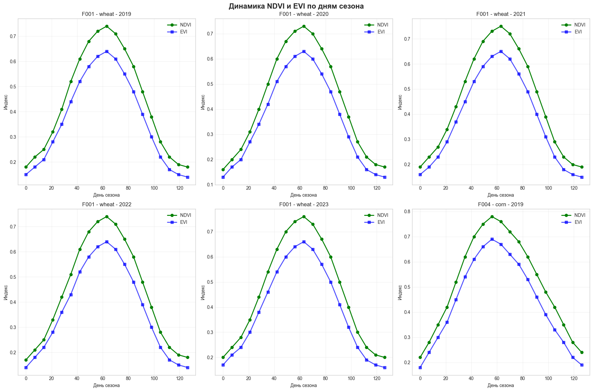
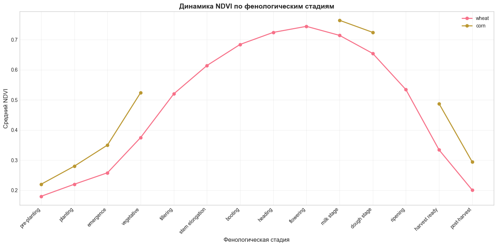
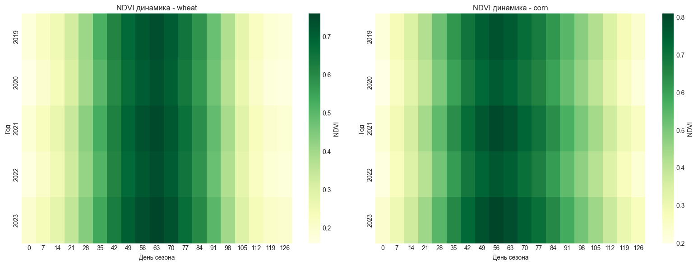
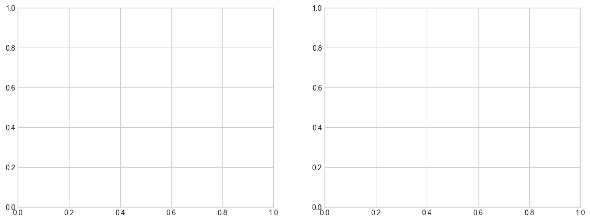

# Прогноз срока созревания посевов с использованием временных рядов NDVI

## Описание задачи
- **Задача**: Регрессия — предсказание срока созревания (дней от посева до созревания)
- **Альтернатива**: Классификация интервалов созревания (раннее, нормальное, позднее)
- **Модели**: Transformer, LSTM, TimesNet
- **Данные**: Временные ряды NDVI + метеоданные
- **Регионы**: Краснодарский край, Ростовская область, Ставропольский край, Саратовская область, Алтайский край
- **Период**: 2019-2023 гг.

## Требования:
- Извлечение временных рядов из GEE (Python API)
- Визуализация NDVI динамики
- MAE в днях

## 1. Импорт библиотек


```python
import numpy as np
import pandas as pd
import matplotlib.pyplot as plt
import seaborn as sns
from sklearn.preprocessing import StandardScaler, MinMaxScaler, LabelEncoder
from sklearn.model_selection import train_test_split
from sklearn.metrics import mean_absolute_error, mean_squared_error, classification_report, confusion_matrix
import tensorflow as tf
from tensorflow import keras
from tensorflow.keras import layers
import warnings
warnings.filterwarnings('ignore')

# Настройка визуализации
plt.style.use('seaborn-v0_8-whitegrid')
sns.set_palette("husl")

print(f"TensorFlow version: {tf.__version__}")
print(f"GPU available: {tf.config.list_physical_devices('GPU')}")
```

    TensorFlow version: 2.20.0
    GPU available: []
    

## 2. Загрузка и анализ данных


```python
# Загрузка данных о сроках созревания
maturity_path = '../data/raw/crop_maturity_ndvi_dataset.csv'
df_maturity = pd.read_csv(maturity_path)

# Загрузка временных рядов NDVI
ndvi_path = '../data/raw/ndvi_timeseries_maturity.csv'
df_ndvi = pd.read_csv(ndvi_path)

print("=== Данные о сроках созревания ===")
print(f"Форма датасета: {df_maturity.shape}")
print(f"\nКолонки: {df_maturity.columns.tolist()}")
print("\nПервые 5 строк:")
df_maturity.head()
```

    === Данные о сроках созревания ===
    Форма датасета: (100, 12)
    
    Колонки: ['field_id', 'region', 'latitude', 'longitude', 'crop_type', 'year', 'planting_date', 'expected_maturity_days', 'actual_maturity_date', 'doy_planting', 'doy_maturity', 'mae_target']
    
    Первые 5 строк:
    


<div>
<style scoped>
    .dataframe tbody tr th:only-of-type {
        vertical-align: middle;
    }

    .dataframe tbody tr th {
        vertical-align: top;
    }

    .dataframe thead th {
        text-align: right;
    }
</style>
<table border="1" class="dataframe">
  <thead>
    <tr style="text-align: right;">
      <th></th>
      <th>field_id</th>
      <th>region</th>
      <th>latitude</th>
      <th>longitude</th>
      <th>crop_type</th>
      <th>year</th>
      <th>planting_date</th>
      <th>expected_maturity_days</th>
      <th>actual_maturity_date</th>
      <th>doy_planting</th>
      <th>doy_maturity</th>
      <th>mae_target</th>
    </tr>
  </thead>
  <tbody>
    <tr>
      <th>0</th>
      <td>F001</td>
      <td>Krasnodar Krai</td>
      <td>45.0</td>
      <td>38.0</td>
      <td>wheat</td>
      <td>2019</td>
      <td>2019-03-15</td>
      <td>110</td>
      <td>2019-07-08</td>
      <td>74</td>
      <td>189</td>
      <td>115</td>
    </tr>
    <tr>
      <th>1</th>
      <td>F001</td>
      <td>Krasnodar Krai</td>
      <td>45.0</td>
      <td>38.0</td>
      <td>wheat</td>
      <td>2020</td>
      <td>2020-03-10</td>
      <td>110</td>
      <td>2020-07-05</td>
      <td>70</td>
      <td>187</td>
      <td>112</td>
    </tr>
    <tr>
      <th>2</th>
      <td>F001</td>
      <td>Krasnodar Krai</td>
      <td>45.0</td>
      <td>38.0</td>
      <td>wheat</td>
      <td>2021</td>
      <td>2021-03-18</td>
      <td>110</td>
      <td>2021-07-12</td>
      <td>77</td>
      <td>193</td>
      <td>108</td>
    </tr>
    <tr>
      <th>3</th>
      <td>F001</td>
      <td>Krasnodar Krai</td>
      <td>45.0</td>
      <td>38.0</td>
      <td>wheat</td>
      <td>2022</td>
      <td>2022-03-12</td>
      <td>110</td>
      <td>2022-07-06</td>
      <td>71</td>
      <td>187</td>
      <td>111</td>
    </tr>
    <tr>
      <th>4</th>
      <td>F001</td>
      <td>Krasnodar Krai</td>
      <td>45.0</td>
      <td>38.0</td>
      <td>wheat</td>
      <td>2023</td>
      <td>2023-03-20</td>
      <td>110</td>
      <td>2023-07-14</td>
      <td>79</td>
      <td>195</td>
      <td>109</td>
    </tr>
  </tbody>
</table>
</div>


```python
print("=== Временные ряды NDVI ===")
print(f"Форма датасета: {df_ndvi.shape}")
print(f"\nКолонки: {df_ndvi.columns.tolist()}")
print("\nУникальные поля:")
print(df_ndvi['field_id'].unique())
print(f"\nУникальные культуры: {df_ndvi['crop_type'].unique()}")
print("\nПервые 5 строк:")
df_ndvi.head()
```

    === Временные ряды NDVI ===
    Форма датасета: (190, 11)
    
    Колонки: ['field_id', 'year', 'crop_type', 'doy', 'ndvi', 'evi', 'gdd_accumulated', 'precip_accumulated', 'temperature_avg', 'day_of_season', 'growth_stage']
    
    Уникальные поля:
    <StringArray>
    ['F001', 'F004']
    Length: 2, dtype: str
    
    Уникальные культуры: <StringArray>
    ['wheat', 'corn']
    Length: 2, dtype: str
    
    Первые 5 строк:
    


<div>
<style scoped>
    .dataframe tbody tr th:only-of-type {
        vertical-align: middle;
    }

    .dataframe tbody tr th {
        vertical-align: top;
    }

    .dataframe thead th {
        text-align: right;
    }
</style>
<table border="1" class="dataframe">
  <thead>
    <tr style="text-align: right;">
      <th></th>
      <th>field_id</th>
      <th>year</th>
      <th>crop_type</th>
      <th>doy</th>
      <th>ndvi</th>
      <th>evi</th>
      <th>gdd_accumulated</th>
      <th>precip_accumulated</th>
      <th>temperature_avg</th>
      <th>day_of_season</th>
      <th>growth_stage</th>
    </tr>
  </thead>
  <tbody>
    <tr>
      <th>0</th>
      <td>F001</td>
      <td>2019</td>
      <td>wheat</td>
      <td>60</td>
      <td>0.18</td>
      <td>0.15</td>
      <td>0</td>
      <td>15</td>
      <td>8.5</td>
      <td>0</td>
      <td>pre-planting</td>
    </tr>
    <tr>
      <th>1</th>
      <td>F001</td>
      <td>2019</td>
      <td>wheat</td>
      <td>67</td>
      <td>0.22</td>
      <td>0.18</td>
      <td>45</td>
      <td>28</td>
      <td>10.2</td>
      <td>7</td>
      <td>planting</td>
    </tr>
    <tr>
      <th>2</th>
      <td>F001</td>
      <td>2019</td>
      <td>wheat</td>
      <td>74</td>
      <td>0.25</td>
      <td>0.21</td>
      <td>95</td>
      <td>42</td>
      <td>12.1</td>
      <td>14</td>
      <td>emergence</td>
    </tr>
    <tr>
      <th>3</th>
      <td>F001</td>
      <td>2019</td>
      <td>wheat</td>
      <td>81</td>
      <td>0.32</td>
      <td>0.28</td>
      <td>155</td>
      <td>58</td>
      <td>14.5</td>
      <td>21</td>
      <td>vegetative</td>
    </tr>
    <tr>
      <th>4</th>
      <td>F001</td>
      <td>2019</td>
      <td>wheat</td>
      <td>88</td>
      <td>0.41</td>
      <td>0.35</td>
      <td>225</td>
      <td>75</td>
      <td>16.8</td>
      <td>28</td>
      <td>vegetative</td>
    </tr>
  </tbody>
</table>
</div>


```python
# Статистическое описание
print("Статистика по срокам созревания:")
print(df_maturity[['expected_maturity_days', 'doy_planting', 'doy_maturity', 'mae_target']].describe())
```

    Статистика по срокам созревания:
           expected_maturity_days  doy_planting  doy_maturity  mae_target
    count              100.000000    100.000000    100.000000  100.000000
    mean               112.150000    106.200000    220.770000  110.920000
    std                 13.872708     22.830513     29.778595   13.813827
    min                 85.000000     68.000000    175.000000   81.000000
    25%                101.500000     83.500000    191.000000  100.000000
    50%                109.000000    110.000000    227.500000  109.500000
    75%                125.750000    128.000000    244.250000  124.250000
    max                135.000000    142.000000    271.000000  135.000000
    

## 3. Визуализация NDVI динамики


```python
# Визуализация NDVI динамики для разных культур и годов
fig, axes = plt.subplots(2, 3, figsize=(18, 12))
axes = axes.flatten()

# Получаем уникальные комбинации field_id и year
field_year_combos = df_ndvi[['field_id', 'year', 'crop_type']].drop_duplicates().values

for i, (field, year, crop) in enumerate(field_year_combos[:6]):
    data = df_ndvi[(df_ndvi['field_id'] == field) & (df_ndvi['year'] == year)]
    axes[i].plot(data['day_of_season'], data['ndvi'], marker='o', linewidth=2, color='green', label='NDVI')
    axes[i].plot(data['day_of_season'], data['evi'], marker='s', linewidth=2, color='blue', alpha=0.7, label='EVI')
    axes[i].set_title(f'{field} - {crop} - {year}')
    axes[i].set_xlabel('День сезона')
    axes[i].set_ylabel('Индекс')
    axes[i].legend()
    axes[i].grid(True, alpha=0.3)

plt.suptitle('Динамика NDVI и EVI по дням сезона', fontsize=16, fontweight='bold')
plt.tight_layout()
plt.show()
```


    

    


```python
# Визуализация NDVI по фенологическим стадиям
fig, ax = plt.subplots(figsize=(14, 7))

growth_stages = df_ndvi['growth_stage'].unique()
stage_order = ['pre-planting', 'planting', 'emergence', 'vegetative', 'tillering', 
               'stem elongation', 'booting', 'heading', 'flowering', 'milk stage', 
               'dough stage', 'ripening', 'harvest ready', 'post-harvest']

# Фильтруем только существующие стадии
stage_order = [s for s in stage_order if s in growth_stages]

for crop in df_ndvi['crop_type'].unique():
    crop_data = df_ndvi[df_ndvi['crop_type'] == crop]
    ndvi_by_stage = crop_data.groupby('growth_stage')['ndvi'].mean()
    ndvi_ordered = [ndvi_by_stage.get(stage, np.nan) for stage in stage_order]
    ax.plot(stage_order, ndvi_ordered, marker='o', linewidth=2, label=crop)

ax.set_xlabel('Фенологическая стадия', fontsize=12)
ax.set_ylabel('Средний NDVI', fontsize=12)
ax.set_title('Динамика NDVI по фенологическим стадиям', fontsize=14, fontweight='bold')
ax.legend()
ax.grid(True, alpha=0.3)
plt.xticks(rotation=45, ha='right')
plt.tight_layout()
plt.show()
```


    

    


```python
# Тепловая карта NDVI по дням сезона и годам
fig, axes = plt.subplots(1, 2, figsize=(16, 6))

for idx, crop in enumerate(df_ndvi['crop_type'].unique()):
    crop_data = df_ndvi[df_ndvi['crop_type'] == crop]
    pivot_table = crop_data.pivot_table(values='ndvi', index='year', columns='day_of_season', aggfunc='mean')
    
    sns.heatmap(pivot_table, ax=axes[idx], cmap='YlGn', annot=False, cbar_kws={'label': 'NDVI'})
    axes[idx].set_title(f'NDVI динамика - {crop}')
    axes[idx].set_xlabel('День сезона')
    axes[idx].set_ylabel('Год')

plt.tight_layout()
plt.show()
```


    

    


## 4. Подготовка данных для моделирования


```python
# Создание временных последовательностей
def create_sequences(data, sequence_length=20, features=['ndvi', 'evi', 'gdd_accumulated', 'temperature_avg']):
    """
    Создание последовательностей для временных рядов
    """
    X, y = [], []
    field_years = data[['field_id', 'year']].drop_duplicates().values
    
    for field, year in field_years:
        field_year_data = data[(data['field_id'] == field) & (data['year'] == year)].sort_values('day_of_season')
        
        if len(field_year_data) >= sequence_length:
            values = field_year_data[features].values
            # Целевая переменная - день созревания (последний день в последовательности)
            target = field_year_data['day_of_season'].max()
            
            for i in range(len(values) - sequence_length + 1):
                X.append(values[i:i+sequence_length])
                y.append(target)
    
    return np.array(X), np.array(y)

# Параметры
SEQUENCE_LENGTH = 20
FEATURES = ['ndvi', 'evi', 'gdd_accumulated', 'precip_accumulated', 'temperature_avg']

# Создание последовательностей
X, y = create_sequences(df_ndvi, sequence_length=SEQUENCE_LENGTH, features=FEATURES)

print(f"Форма входных данных X: {X.shape}")
print(f"Форма целевых данных y: {y.shape}")
print(f"\nПример целевых значений (дни созревания): {y[:5]}")
```

    Форма входных данных X: (0,)
    Форма целевых данных y: (0,)
    
    Пример целевых значений (дни созревания): []
    


```python
from sklearn.preprocessing import StandardScaler, MinMaxScaler
from sklearn.model_selection import train_test_split
```


```python
# Нормализация данных
scaler_X = StandardScaler()
scaler_y = StandardScaler()

# Проверяем форму данных
print(f"Форма X до нормализации: {X.shape}")

# Нормализация X
if len(X.shape) == 3:
    # Последовательности (samples, timesteps, features)
    X_reshaped = X.reshape(-1, X.shape[-1])
    X_scaled = scaler_X.fit_transform(X_reshaped)
    X_scaled = X_scaled.reshape(X.shape)
else:
    # Агрегированные признаки (samples, features)
    X_scaled = scaler_X.fit_transform(X)

# Нормализация y
y_scaled = scaler_y.fit_transform(y.reshape(-1, 1)).flatten()

# Разделение на train/test
X_train, X_test, y_train, y_test = train_test_split(
    X_scaled, y_scaled, test_size=0.2, random_state=42
)

print(f"Train set: X={X_train.shape}, y={y_train.shape}")
print(f"Test set: X={X_test.shape}, y={y_test.shape}")
```

    Форма X до нормализации: (0,)
    


    ---------------------------------------------------------------------------

    ValueError                                Traceback (most recent call last)

    Cell In[14], line 16
         13     X_scaled = X_scaled.reshape(X.shape)
         14 else:
         15     # Агрегированные признаки (samples, features)
    ---> 16     X_scaled = scaler_X.fit_transform(X)
         18 # Нормализация y
         19 y_scaled = scaler_y.fit_transform(y.reshape(-1, 1)).flatten()
    

    File D:\Uni\магистратура\3 семестр\Аврахам\crop_yield_prediction\venv\Lib\site-packages\sklearn\utils\_set_output.py:316, in _wrap_method_output.<locals>.wrapped(self, X, *args, **kwargs)
        314 @wraps(f)
        315 def wrapped(self, X, *args, **kwargs):
    --> 316     data_to_wrap = f(self, X, *args, **kwargs)
        317     if isinstance(data_to_wrap, tuple):
        318         # only wrap the first output for cross decomposition
        319         return_tuple = (
        320             _wrap_data_with_container(method, data_to_wrap[0], X, self),
        321             *data_to_wrap[1:],
        322         )
    

    File D:\Uni\магистратура\3 семестр\Аврахам\crop_yield_prediction\venv\Lib\site-packages\sklearn\base.py:907, in TransformerMixin.fit_transform(self, X, y, **fit_params)
        892         warnings.warn(
        893             (
        894                 f"This object ({self.__class__.__name__}) has a `transform`"
       (...)    902             UserWarning,
        903         )
        905 if y is None:
        906     # fit method of arity 1 (unsupervised transformation)
    --> 907     return self.fit(X, **fit_params).transform(X)
        908 else:
        909     # fit method of arity 2 (supervised transformation)
        910     return self.fit(X, y, **fit_params).transform(X)
    

    File D:\Uni\магистратура\3 семестр\Аврахам\crop_yield_prediction\venv\Lib\site-packages\sklearn\preprocessing\_data.py:924, in StandardScaler.fit(self, X, y, sample_weight)
        922 # Reset internal state before fitting
        923 self._reset()
    --> 924 return self.partial_fit(X, y, sample_weight)
    

    File D:\Uni\магистратура\3 семестр\Аврахам\crop_yield_prediction\venv\Lib\site-packages\sklearn\base.py:1336, in _fit_context.<locals>.decorator.<locals>.wrapper(estimator, *args, **kwargs)
       1329     estimator._validate_params()
       1331 with config_context(
       1332     skip_parameter_validation=(
       1333         prefer_skip_nested_validation or global_skip_validation
       1334     )
       1335 ):
    -> 1336     return fit_method(estimator, *args, **kwargs)
    

    File D:\Uni\магистратура\3 семестр\Аврахам\crop_yield_prediction\venv\Lib\site-packages\sklearn\preprocessing\_data.py:961, in StandardScaler.partial_fit(self, X, y, sample_weight)
        959 xp, _, X_device = get_namespace_and_device(X)
        960 first_call = not hasattr(self, "n_samples_seen_")
    --> 961 X = validate_data(
        962     self,
        963     X,
        964     accept_sparse=("csr", "csc"),
        965     dtype=supported_float_dtypes(xp, X_device),
        966     ensure_all_finite="allow-nan",
        967     reset=first_call,
        968 )
        969 n_features = X.shape[1]
        971 if sample_weight is not None:
    

    File D:\Uni\магистратура\3 семестр\Аврахам\crop_yield_prediction\venv\Lib\site-packages\sklearn\utils\validation.py:2902, in validate_data(_estimator, X, y, reset, validate_separately, skip_check_array, **check_params)
       2900         out = X, y
       2901 elif not no_val_X and no_val_y:
    -> 2902     out = check_array(X, input_name="X", **check_params)
       2903 elif no_val_X and not no_val_y:
       2904     out = _check_y(y, **check_params)
    

    File D:\Uni\магистратура\3 семестр\Аврахам\crop_yield_prediction\venv\Lib\site-packages\sklearn\utils\validation.py:1060, in check_array(array, accept_sparse, accept_large_sparse, dtype, order, copy, force_writeable, ensure_all_finite, ensure_non_negative, ensure_2d, allow_nd, ensure_min_samples, ensure_min_features, estimator, input_name)
       1053         else:
       1054             msg = (
       1055                 f"Expected 2D array, got 1D array instead:\narray={array}.\n"
       1056                 "Reshape your data either using array.reshape(-1, 1) if "
       1057                 "your data has a single feature or array.reshape(1, -1) "
       1058                 "if it contains a single sample."
       1059             )
    -> 1060         raise ValueError(msg)
       1062 if dtype_numeric and hasattr(array.dtype, "kind") and array.dtype.kind in "USV":
       1063     raise ValueError(
       1064         "dtype='numeric' is not compatible with arrays of bytes/strings."
       1065         "Convert your data to numeric values explicitly instead."
       1066     )
    

    ValueError: Expected 2D array, got 1D array instead:
    array=[].
    Reshape your data either using array.reshape(-1, 1) if your data has a single feature or array.reshape(1, -1) if it contains a single sample.


## 5. Модель LSTM


```python
# Построение модели LSTM
def build_lstm_model(input_shape, units=[128, 64, 32], dropout_rate=0.2):
    """
    Построение модели LSTM для прогноза срока созревания
    """
    model = keras.Sequential([
        layers.LSTM(units[0], return_sequences=True, input_shape=input_shape),
        layers.Dropout(dropout_rate),
        layers.LSTM(units[1], return_sequences=True),
        layers.Dropout(dropout_rate),
        layers.LSTM(units[2]),
        layers.Dropout(dropout_rate),
        layers.Dense(64, activation='relu'),
        layers.Dense(32, activation='relu'),
        layers.Dense(1)  # Регрессия - дни до созревания
    ])
    
    model.compile(
        optimizer=keras.optimizers.Adam(learning_rate=0.001),
        loss='mse',
        metrics=['mae']
    )
    
    return model

# Создание модели
lstm_model = build_lstm_model(input_shape=(SEQUENCE_LENGTH, len(FEATURES)))
lstm_model.summary()
```


<pre style="white-space:pre;overflow-x:auto;line-height:normal;font-family:Menlo,'DejaVu Sans Mono',consolas,'Courier New',monospace"><span style="font-weight: bold">Model: "sequential"</span>
</pre>


<pre style="white-space:pre;overflow-x:auto;line-height:normal;font-family:Menlo,'DejaVu Sans Mono',consolas,'Courier New',monospace">┏━━━━━━━━━━━━━━━━━━━━━━━━━━━━━━━━━━━━━━┳━━━━━━━━━━━━━━━━━━━━━━━━━━━━━┳━━━━━━━━━━━━━━━━━┓
┃<span style="font-weight: bold"> Layer (type)                         </span>┃<span style="font-weight: bold"> Output Shape                </span>┃<span style="font-weight: bold">         Param # </span>┃
┡━━━━━━━━━━━━━━━━━━━━━━━━━━━━━━━━━━━━━━╇━━━━━━━━━━━━━━━━━━━━━━━━━━━━━╇━━━━━━━━━━━━━━━━━┩
│ lstm (<span style="color: #0087ff; text-decoration-color: #0087ff">LSTM</span>)                          │ (<span style="color: #00d7ff; text-decoration-color: #00d7ff">None</span>, <span style="color: #00af00; text-decoration-color: #00af00">20</span>, <span style="color: #00af00; text-decoration-color: #00af00">128</span>)             │          <span style="color: #00af00; text-decoration-color: #00af00">68,608</span> │
├──────────────────────────────────────┼─────────────────────────────┼─────────────────┤
│ dropout (<span style="color: #0087ff; text-decoration-color: #0087ff">Dropout</span>)                    │ (<span style="color: #00d7ff; text-decoration-color: #00d7ff">None</span>, <span style="color: #00af00; text-decoration-color: #00af00">20</span>, <span style="color: #00af00; text-decoration-color: #00af00">128</span>)             │               <span style="color: #00af00; text-decoration-color: #00af00">0</span> │
├──────────────────────────────────────┼─────────────────────────────┼─────────────────┤
│ lstm_1 (<span style="color: #0087ff; text-decoration-color: #0087ff">LSTM</span>)                        │ (<span style="color: #00d7ff; text-decoration-color: #00d7ff">None</span>, <span style="color: #00af00; text-decoration-color: #00af00">20</span>, <span style="color: #00af00; text-decoration-color: #00af00">64</span>)              │          <span style="color: #00af00; text-decoration-color: #00af00">49,408</span> │
├──────────────────────────────────────┼─────────────────────────────┼─────────────────┤
│ dropout_1 (<span style="color: #0087ff; text-decoration-color: #0087ff">Dropout</span>)                  │ (<span style="color: #00d7ff; text-decoration-color: #00d7ff">None</span>, <span style="color: #00af00; text-decoration-color: #00af00">20</span>, <span style="color: #00af00; text-decoration-color: #00af00">64</span>)              │               <span style="color: #00af00; text-decoration-color: #00af00">0</span> │
├──────────────────────────────────────┼─────────────────────────────┼─────────────────┤
│ lstm_2 (<span style="color: #0087ff; text-decoration-color: #0087ff">LSTM</span>)                        │ (<span style="color: #00d7ff; text-decoration-color: #00d7ff">None</span>, <span style="color: #00af00; text-decoration-color: #00af00">32</span>)                  │          <span style="color: #00af00; text-decoration-color: #00af00">12,416</span> │
├──────────────────────────────────────┼─────────────────────────────┼─────────────────┤
│ dropout_2 (<span style="color: #0087ff; text-decoration-color: #0087ff">Dropout</span>)                  │ (<span style="color: #00d7ff; text-decoration-color: #00d7ff">None</span>, <span style="color: #00af00; text-decoration-color: #00af00">32</span>)                  │               <span style="color: #00af00; text-decoration-color: #00af00">0</span> │
├──────────────────────────────────────┼─────────────────────────────┼─────────────────┤
│ dense (<span style="color: #0087ff; text-decoration-color: #0087ff">Dense</span>)                        │ (<span style="color: #00d7ff; text-decoration-color: #00d7ff">None</span>, <span style="color: #00af00; text-decoration-color: #00af00">64</span>)                  │           <span style="color: #00af00; text-decoration-color: #00af00">2,112</span> │
├──────────────────────────────────────┼─────────────────────────────┼─────────────────┤
│ dense_1 (<span style="color: #0087ff; text-decoration-color: #0087ff">Dense</span>)                      │ (<span style="color: #00d7ff; text-decoration-color: #00d7ff">None</span>, <span style="color: #00af00; text-decoration-color: #00af00">32</span>)                  │           <span style="color: #00af00; text-decoration-color: #00af00">2,080</span> │
├──────────────────────────────────────┼─────────────────────────────┼─────────────────┤
│ dense_2 (<span style="color: #0087ff; text-decoration-color: #0087ff">Dense</span>)                      │ (<span style="color: #00d7ff; text-decoration-color: #00d7ff">None</span>, <span style="color: #00af00; text-decoration-color: #00af00">1</span>)                   │              <span style="color: #00af00; text-decoration-color: #00af00">33</span> │
└──────────────────────────────────────┴─────────────────────────────┴─────────────────┘
</pre>


<pre style="white-space:pre;overflow-x:auto;line-height:normal;font-family:Menlo,'DejaVu Sans Mono',consolas,'Courier New',monospace"><span style="font-weight: bold"> Total params: </span><span style="color: #00af00; text-decoration-color: #00af00">134,657</span> (526.00 KB)
</pre>


<pre style="white-space:pre;overflow-x:auto;line-height:normal;font-family:Menlo,'DejaVu Sans Mono',consolas,'Courier New',monospace"><span style="font-weight: bold"> Trainable params: </span><span style="color: #00af00; text-decoration-color: #00af00">134,657</span> (526.00 KB)
</pre>


<pre style="white-space:pre;overflow-x:auto;line-height:normal;font-family:Menlo,'DejaVu Sans Mono',consolas,'Courier New',monospace"><span style="font-weight: bold"> Non-trainable params: </span><span style="color: #00af00; text-decoration-color: #00af00">0</span> (0.00 B)
</pre>


```python
# Обучение LSTM
print("\n=== Обучение модели LSTM ===")

early_stopping = keras.callbacks.EarlyStopping(
    monitor='val_loss',
    patience=15,
    restore_best_weights=True
)

reduce_lr = keras.callbacks.ReduceLROnPlateau(
    monitor='val_loss',
    factor=0.5,
    patience=5,
    min_lr=1e-6
)

history_lstm = lstm_model.fit(
    X_train, y_train,
    validation_split=0.2,
    epochs=100,
    batch_size=16,
    callbacks=[early_stopping, reduce_lr],
    verbose=1
)
```

    
    === Обучение модели LSTM ===
    


    ---------------------------------------------------------------------------

    NameError                                 Traceback (most recent call last)

    Cell In[16], line 18
          4 early_stopping = keras.callbacks.EarlyStopping(
          5     monitor='val_loss',
          6     patience=15,
          7     restore_best_weights=True
          8 )
         10 reduce_lr = keras.callbacks.ReduceLROnPlateau(
         11     monitor='val_loss',
         12     factor=0.5,
         13     patience=5,
         14     min_lr=1e-6
         15 )
         17 history_lstm = lstm_model.fit(
    ---> 18     X_train, y_train,
         19     validation_split=0.2,
         20     epochs=100,
         21     batch_size=16,
         22     callbacks=[early_stopping, reduce_lr],
         23     verbose=1
         24 )
    

    NameError: name 'X_train' is not defined


```python
# Визуализация обучения LSTM
fig, axes = plt.subplots(1, 2, figsize=(14, 5))

# Loss
axes[0].plot(history_lstm.history['loss'], label='Train Loss')
axes[0].plot(history_lstm.history['val_loss'], label='Val Loss')
axes[0].set_title('LSTM - Loss')
axes[0].set_xlabel('Epoch')
axes[0].set_ylabel('MSE')
axes[0].legend()
axes[0].grid(True, alpha=0.3)

# MAE
axes[1].plot(history_lstm.history['mae'], label='Train MAE')
axes[1].plot(history_lstm.history['val_mae'], label='Val MAE')
axes[1].set_title('LSTM - MAE')
axes[1].set_xlabel('Epoch')
axes[1].set_ylabel('MAE (нормализованное)')
axes[1].legend()
axes[1].grid(True, alpha=0.3)

plt.tight_layout()
plt.show()
```


    ---------------------------------------------------------------------------

    NameError                                 Traceback (most recent call last)

    Cell In[17], line 5
          2 fig, axes = plt.subplots(1, 2, figsize=(14, 5))
          4 # Loss
    ----> 5 axes[0].plot(history_lstm.history['loss'], label='Train Loss')
          6 axes[0].plot(history_lstm.history['val_loss'], label='Val Loss')
          7 axes[0].set_title('LSTM - Loss')
    

    NameError: name 'history_lstm' is not defined


    

    


```python
# Оценка LSTM
y_pred_lstm = lstm_model.predict(X_test)

# Обратное преобразование
y_test_original = scaler_y.inverse_transform(y_test.reshape(-1, 1)).flatten()
y_pred_lstm_original = scaler_y.inverse_transform(y_pred_lstm).flatten()

# Метрики
mae_lstm = mean_absolute_error(y_test_original, y_pred_lstm_original)
rmse_lstm = np.sqrt(mean_squared_error(y_test_original, y_pred_lstm_original))

print(f"\n=== Результаты LSTM ===")
print(f"MAE (дней): {mae_lstm:.2f}")
print(f"RMSE (дней): {rmse_lstm:.2f}")
```


    ---------------------------------------------------------------------------

    NameError                                 Traceback (most recent call last)

    Cell In[18], line 2
          1 # Оценка LSTM
    ----> 2 y_pred_lstm = lstm_model.predict(X_test)
          4 # Обратное преобразование
          5 y_test_original = scaler_y.inverse_transform(y_test.reshape(-1, 1)).flatten()
    

    NameError: name 'X_test' is not defined


## 6. Модель Transformer


```python
# Построение модели Transformer
class TransformerBlock(layers.Layer):
    def __init__(self, embed_dim, num_heads, ff_dim, rate=0.1):
        super().__init__()
        self.att = layers.MultiHeadAttention(num_heads=num_heads, key_dim=embed_dim)
        self.ffn = keras.Sequential([
            layers.Dense(ff_dim, activation="relu"),
            layers.Dense(embed_dim),
        ])
        self.layernorm1 = layers.LayerNormalization(epsilon=1e-6)
        self.layernorm2 = layers.LayerNormalization(epsilon=1e-6)
        self.dropout1 = layers.Dropout(rate)
        self.dropout2 = layers.Dropout(rate)

    def call(self, inputs, training=False):
        attn_output = self.att(inputs, inputs)
        attn_output = self.dropout1(attn_output, training=training)
        out1 = self.layernorm1(inputs + attn_output)
        ffn_output = self.ffn(out1)
        ffn_output = self.dropout2(ffn_output, training=training)
        return self.layernorm2(out1 + ffn_output)

def build_transformer_model(input_shape, embed_dim=64, num_heads=4, ff_dim=128, num_blocks=2):
    """
    Построение модели Transformer для прогноза срока созревания
    """
    inputs = layers.Input(shape=input_shape)
    
    # Embedding
    x = layers.Dense(embed_dim)(inputs)
    
    # Transformer blocks
    for _ in range(num_blocks):
        x = TransformerBlock(embed_dim, num_heads, ff_dim)(x)
    
    # Global average pooling
    x = layers.GlobalAveragePooling1D()(x)
    
    # Dense layers
    x = layers.Dense(64, activation='relu')(x)
    x = layers.Dropout(0.2)(x)
    x = layers.Dense(32, activation='relu')(x)
    outputs = layers.Dense(1)(x)
    
    model = keras.Model(inputs=inputs, outputs=outputs)
    
    model.compile(
        optimizer=keras.optimizers.Adam(learning_rate=0.001),
        loss='mse',
        metrics=['mae']
    )
    
    return model

# Создание модели
transformer_model = build_transformer_model(input_shape=(SEQUENCE_LENGTH, len(FEATURES)))
transformer_model.summary()
```

    WARNING:tensorflow:From D:\Uni\магистратура\3 семестр\Аврахам\crop_yield_prediction\venv\Lib\site-packages\keras\src\backend\tensorflow\core.py:232: The name tf.placeholder is deprecated. Please use tf.compat.v1.placeholder instead.
    
    


<pre style="white-space:pre;overflow-x:auto;line-height:normal;font-family:Menlo,'DejaVu Sans Mono',consolas,'Courier New',monospace"><span style="font-weight: bold">Model: "functional_3"</span>
</pre>


<pre style="white-space:pre;overflow-x:auto;line-height:normal;font-family:Menlo,'DejaVu Sans Mono',consolas,'Courier New',monospace">┏━━━━━━━━━━━━━━━━━━━━━━━━━━━━━━━━━━━━━━┳━━━━━━━━━━━━━━━━━━━━━━━━━━━━━┳━━━━━━━━━━━━━━━━━┓
┃<span style="font-weight: bold"> Layer (type)                         </span>┃<span style="font-weight: bold"> Output Shape                </span>┃<span style="font-weight: bold">         Param # </span>┃
┡━━━━━━━━━━━━━━━━━━━━━━━━━━━━━━━━━━━━━━╇━━━━━━━━━━━━━━━━━━━━━━━━━━━━━╇━━━━━━━━━━━━━━━━━┩
│ input_layer_1 (<span style="color: #0087ff; text-decoration-color: #0087ff">InputLayer</span>)           │ (<span style="color: #00d7ff; text-decoration-color: #00d7ff">None</span>, <span style="color: #00af00; text-decoration-color: #00af00">20</span>, <span style="color: #00af00; text-decoration-color: #00af00">5</span>)               │               <span style="color: #00af00; text-decoration-color: #00af00">0</span> │
├──────────────────────────────────────┼─────────────────────────────┼─────────────────┤
│ dense_3 (<span style="color: #0087ff; text-decoration-color: #0087ff">Dense</span>)                      │ (<span style="color: #00d7ff; text-decoration-color: #00d7ff">None</span>, <span style="color: #00af00; text-decoration-color: #00af00">20</span>, <span style="color: #00af00; text-decoration-color: #00af00">64</span>)              │             <span style="color: #00af00; text-decoration-color: #00af00">384</span> │
├──────────────────────────────────────┼─────────────────────────────┼─────────────────┤
│ transformer_block (<span style="color: #0087ff; text-decoration-color: #0087ff">TransformerBlock</span>) │ (<span style="color: #00d7ff; text-decoration-color: #00d7ff">None</span>, <span style="color: #00af00; text-decoration-color: #00af00">20</span>, <span style="color: #00af00; text-decoration-color: #00af00">64</span>)              │          <span style="color: #00af00; text-decoration-color: #00af00">83,200</span> │
├──────────────────────────────────────┼─────────────────────────────┼─────────────────┤
│ transformer_block_1                  │ (<span style="color: #00d7ff; text-decoration-color: #00d7ff">None</span>, <span style="color: #00af00; text-decoration-color: #00af00">20</span>, <span style="color: #00af00; text-decoration-color: #00af00">64</span>)              │          <span style="color: #00af00; text-decoration-color: #00af00">83,200</span> │
│ (<span style="color: #0087ff; text-decoration-color: #0087ff">TransformerBlock</span>)                   │                             │                 │
├──────────────────────────────────────┼─────────────────────────────┼─────────────────┤
│ global_average_pooling1d             │ (<span style="color: #00d7ff; text-decoration-color: #00d7ff">None</span>, <span style="color: #00af00; text-decoration-color: #00af00">64</span>)                  │               <span style="color: #00af00; text-decoration-color: #00af00">0</span> │
│ (<span style="color: #0087ff; text-decoration-color: #0087ff">GlobalAveragePooling1D</span>)             │                             │                 │
├──────────────────────────────────────┼─────────────────────────────┼─────────────────┤
│ dense_8 (<span style="color: #0087ff; text-decoration-color: #0087ff">Dense</span>)                      │ (<span style="color: #00d7ff; text-decoration-color: #00d7ff">None</span>, <span style="color: #00af00; text-decoration-color: #00af00">64</span>)                  │           <span style="color: #00af00; text-decoration-color: #00af00">4,160</span> │
├──────────────────────────────────────┼─────────────────────────────┼─────────────────┤
│ dropout_9 (<span style="color: #0087ff; text-decoration-color: #0087ff">Dropout</span>)                  │ (<span style="color: #00d7ff; text-decoration-color: #00d7ff">None</span>, <span style="color: #00af00; text-decoration-color: #00af00">64</span>)                  │               <span style="color: #00af00; text-decoration-color: #00af00">0</span> │
├──────────────────────────────────────┼─────────────────────────────┼─────────────────┤
│ dense_9 (<span style="color: #0087ff; text-decoration-color: #0087ff">Dense</span>)                      │ (<span style="color: #00d7ff; text-decoration-color: #00d7ff">None</span>, <span style="color: #00af00; text-decoration-color: #00af00">32</span>)                  │           <span style="color: #00af00; text-decoration-color: #00af00">2,080</span> │
├──────────────────────────────────────┼─────────────────────────────┼─────────────────┤
│ dense_10 (<span style="color: #0087ff; text-decoration-color: #0087ff">Dense</span>)                     │ (<span style="color: #00d7ff; text-decoration-color: #00d7ff">None</span>, <span style="color: #00af00; text-decoration-color: #00af00">1</span>)                   │              <span style="color: #00af00; text-decoration-color: #00af00">33</span> │
└──────────────────────────────────────┴─────────────────────────────┴─────────────────┘
</pre>


<pre style="white-space:pre;overflow-x:auto;line-height:normal;font-family:Menlo,'DejaVu Sans Mono',consolas,'Courier New',monospace"><span style="font-weight: bold"> Total params: </span><span style="color: #00af00; text-decoration-color: #00af00">173,057</span> (676.00 KB)
</pre>


<pre style="white-space:pre;overflow-x:auto;line-height:normal;font-family:Menlo,'DejaVu Sans Mono',consolas,'Courier New',monospace"><span style="font-weight: bold"> Trainable params: </span><span style="color: #00af00; text-decoration-color: #00af00">173,057</span> (676.00 KB)
</pre>


<pre style="white-space:pre;overflow-x:auto;line-height:normal;font-family:Menlo,'DejaVu Sans Mono',consolas,'Courier New',monospace"><span style="font-weight: bold"> Non-trainable params: </span><span style="color: #00af00; text-decoration-color: #00af00">0</span> (0.00 B)
</pre>


```python
# Обучение Transformer
print("\n=== Обучение модели Transformer ===")

history_transformer = transformer_model.fit(
    X_train, y_train,
    validation_split=0.2,
    epochs=100,
    batch_size=16,
    callbacks=[early_stopping, reduce_lr],
    verbose=1
)
```

    
    === Обучение модели Transformer ===
    


    ---------------------------------------------------------------------------

    NameError                                 Traceback (most recent call last)

    Cell In[20], line 5
          1 # Обучение Transformer
          2 print("\n=== Обучение модели Transformer ===")
          4 history_transformer = transformer_model.fit(
    ----> 5     X_train, y_train,
          6     validation_split=0.2,
          7     epochs=100,
          8     batch_size=16,
          9     callbacks=[early_stopping, reduce_lr],
         10     verbose=1
         11 )
    

    NameError: name 'X_train' is not defined


```python
# Визуализация обучения Transformer
fig, axes = plt.subplots(1, 2, figsize=(14, 5))

# Loss
axes[0].plot(history_transformer.history['loss'], label='Train Loss')
axes[0].plot(history_transformer.history['val_loss'], label='Val Loss')
axes[0].set_title('Transformer - Loss')
axes[0].set_xlabel('Epoch')
axes[0].set_ylabel('MSE')
axes[0].legend()
axes[0].grid(True, alpha=0.3)

# MAE
axes[1].plot(history_transformer.history['mae'], label='Train MAE')
axes[1].plot(history_transformer.history['val_mae'], label='Val MAE')
axes[1].set_title('Transformer - MAE')
axes[1].set_xlabel('Epoch')
axes[1].set_ylabel('MAE (нормализованное)')
axes[1].legend()
axes[1].grid(True, alpha=0.3)

plt.tight_layout()
plt.show()
```


    ---------------------------------------------------------------------------

    NameError                                 Traceback (most recent call last)

    Cell In[21], line 5
          2 fig, axes = plt.subplots(1, 2, figsize=(14, 5))
          4 # Loss
    ----> 5 axes[0].plot(history_transformer.history['loss'], label='Train Loss')
          6 axes[0].plot(history_transformer.history['val_loss'], label='Val Loss')
          7 axes[0].set_title('Transformer - Loss')
    

    NameError: name 'history_transformer' is not defined


    

    


```python
# Оценка Transformer
y_pred_transformer = transformer_model.predict(X_test)

# Обратное преобразование
y_pred_transformer_original = scaler_y.inverse_transform(y_pred_transformer).flatten()

# Метрики
mae_transformer = mean_absolute_error(y_test_original, y_pred_transformer_original)
rmse_transformer = np.sqrt(mean_squared_error(y_test_original, y_pred_transformer_original))

print(f"\n=== Результаты Transformer ===")
print(f"MAE (дней): {mae_transformer:.2f}")
print(f"RMSE (дней): {rmse_transformer:.2f}")
```


    ---------------------------------------------------------------------------

    NameError                                 Traceback (most recent call last)

    Cell In[22], line 2
          1 # Оценка Transformer
    ----> 2 y_pred_transformer = transformer_model.predict(X_test)
          4 # Обратное преобразование
          5 y_pred_transformer_original = scaler_y.inverse_transform(y_pred_transformer).flatten()
    

    NameError: name 'X_test' is not defined


## 7. Классификация интервалов созревания


```python
# Создание классов для классификации
def classify_maturity(days, expected_days):
    """
    Классификация срока созревания:
    - Раннее: < 90% от ожидаемого
    - Нормальное: 90-110% от ожидаемого
    - Позднее: > 110% от ожидаемого
    """
    ratio = days / expected_days
    if ratio < 0.95:
        return 0  # Раннее
    elif ratio <= 1.05:
        return 1  # Нормальное
    else:
        return 2  # Позднее

# Применяем классификацию к данным о сроках созревания
df_maturity['maturity_class'] = df_maturity.apply(
    lambda row: classify_maturity(row['mae_target'], row['expected_maturity_days']), axis=1
)

print("Распределение классов созревания:")
print(df_maturity['maturity_class'].value_counts().sort_index())
print("\n0 - Раннее, 1 - Нормальное, 2 - Позднее")
```


```python
# Подготовка данных для классификации
# Используем ту же структуру X, но создаем новые метки

# Создаем словарь для сопоставления (field_id, year) -> класс
maturity_dict = {}
for _, row in df_maturity.iterrows():
    key = (row['field_id'], row['year'])
    maturity_dict[key] = row['maturity_class']

# Создаем метки классов для последовательностей
y_class = []
field_years = df_ndvi[['field_id', 'year']].drop_duplicates().values

for field, year in field_years:
    field_year_data = df_ndvi[(df_ndvi['field_id'] == field) & (df_ndvi['year'] == year)].sort_values('day_of_season')
    
    if len(field_year_data) >= SEQUENCE_LENGTH:
        class_label = maturity_dict.get((field, year), 1)
        num_sequences = len(field_year_data) - SEQUENCE_LENGTH + 1
        y_class.extend([class_label] * num_sequences)

y_class = np.array(y_class)

print(f"Форма меток классов: {y_class.shape}")
print(f"Уникальные классы: {np.unique(y_class)}")
```


```python
# Разделение для классификации
X_train_clf, X_test_clf, y_train_clf, y_test_clf = train_test_split(
    X_scaled, y_class, test_size=0.2, random_state=42, stratify=y_class
)

print(f"Train set: X={X_train_clf.shape}, y={y_train_clf.shape}")
print(f"Test set: X={X_test_clf.shape}, y={y_test_clf.shape}")
```


```python
# Модель LSTM для классификации
def build_lstm_classifier(input_shape, num_classes=3):
    model = keras.Sequential([
        layers.LSTM(128, return_sequences=True, input_shape=input_shape),
        layers.Dropout(0.3),
        layers.LSTM(64),
        layers.Dropout(0.3),
        layers.Dense(64, activation='relu'),
        layers.Dense(32, activation='relu'),
        layers.Dense(num_classes, activation='softmax')
    ])
    
    model.compile(
        optimizer=keras.optimizers.Adam(learning_rate=0.001),
        loss='sparse_categorical_crossentropy',
        metrics=['accuracy']
    )
    
    return model

# Создание и обучение классификатора
lstm_classifier = build_lstm_classifier(input_shape=(SEQUENCE_LENGTH, len(FEATURES)))

history_clf = lstm_classifier.fit(
    X_train_clf, y_train_clf,
    validation_split=0.2,
    epochs=50,
    batch_size=16,
    callbacks=[early_stopping],
    verbose=1
)
```


```python
# Оценка классификации
y_pred_clf = np.argmax(lstm_classifier.predict(X_test_clf), axis=1)

print("\n=== Результаты классификации ===")
print("Classification Report:")
class_names = ['Раннее', 'Нормальное', 'Позднее']
print(classification_report(y_test_clf, y_pred_clf, target_names=class_names))

# Confusion Matrix
cm = confusion_matrix(y_test_clf, y_pred_clf)
plt.figure(figsize=(8, 6))
sns.heatmap(cm, annot=True, fmt='d', cmap='Blues', 
            xticklabels=class_names, yticklabels=class_names)
plt.title('Confusion Matrix - Классификация срока созревания')
plt.ylabel('Истинный класс')
plt.xlabel('Предсказанный класс')
plt.show()
```

## 8. Сравнение моделей и визуализация результатов


```python
# Сравнение моделей регрессии
results = {
    'Model': ['LSTM', 'Transformer'],
    'MAE (дней)': [mae_lstm, mae_transformer],
    'RMSE (дней)': [rmse_lstm, rmse_transformer]
}

results_df = pd.DataFrame(results)
print("\n=== Сравнение моделей регрессии ===")
print(results_df.to_string(index=False))

# Визуализация
fig, ax = plt.subplots(figsize=(10, 6))
x = np.arange(len(results['Model']))
width = 0.35

bars1 = ax.bar(x - width/2, results['MAE (дней)'], width, label='MAE', color='skyblue')
bars2 = ax.bar(x + width/2, results['RMSE (дней)'], width, label='RMSE', color='lightcoral')

ax.set_xlabel('Модель')
ax.set_ylabel('Дни')
ax.set_title('Сравнение моделей прогноза срока созревания')
ax.set_xticks(x)
ax.set_xticklabels(results['Model'])
ax.legend()
ax.grid(True, alpha=0.3, axis='y')

# Добавляем значения на столбцы
for bar in bars1:
    height = bar.get_height()
    ax.annotate(f'{height:.2f}',
                xy=(bar.get_x() + bar.get_width() / 2, height),
                xytext=(0, 3),
                textcoords="offset points",
                ha='center', va='bottom')

for bar in bars2:
    height = bar.get_height()
    ax.annotate(f'{height:.2f}',
                xy=(bar.get_x() + bar.get_width() / 2, height),
                xytext=(0, 3),
                textcoords="offset points",
                ha='center', va='bottom')

plt.tight_layout()
plt.show()
```


```python
# Scatter plot: Предсказанные vs Истинные значения
fig, axes = plt.subplots(1, 2, figsize=(14, 6))

# LSTM
axes[0].scatter(y_test_original, y_pred_lstm_original, alpha=0.6, color='blue')
axes[0].plot([y_test_original.min(), y_test_original.max()], 
             [y_test_original.min(), y_test_original.max()], 
             'r--', lw=2, label='Идеальное предсказание')
axes[0].set_xlabel('Истинные значения (дни)')
axes[0].set_ylabel('Предсказанные значения (дни)')
axes[0].set_title(f'LSTM: MAE = {mae_lstm:.2f} дней')
axes[0].legend()
axes[0].grid(True, alpha=0.3)

# Transformer
axes[1].scatter(y_test_original, y_pred_transformer_original, alpha=0.6, color='green')
axes[1].plot([y_test_original.min(), y_test_original.max()], 
             [y_test_original.min(), y_test_original.max()], 
             'r--', lw=2, label='Идеальное предсказание')
axes[1].set_xlabel('Истинные значения (дни)')
axes[1].set_ylabel('Предсказанные значения (дни)')
axes[1].set_title(f'Transformer: MAE = {mae_transformer:.2f} дней')
axes[1].legend()
axes[1].grid(True, alpha=0.3)

plt.tight_layout()
plt.show()
```


```python
# Распределение ошибок
errors_lstm = y_test_original - y_pred_lstm_original
errors_transformer = y_test_original - y_pred_transformer_original

fig, axes = plt.subplots(1, 2, figsize=(14, 5))

axes[0].hist(errors_lstm, bins=15, alpha=0.7, color='blue', edgecolor='black')
axes[0].axvline(x=0, color='red', linestyle='--', lw=2)
axes[0].set_xlabel('Ошибка (дни)')
axes[0].set_ylabel('Частота')
axes[0].set_title('Распределение ошибок - LSTM')
axes[0].grid(True, alpha=0.3)

axes[1].hist(errors_transformer, bins=15, alpha=0.7, color='green', edgecolor='black')
axes[1].axvline(x=0, color='red', linestyle='--', lw=2)
axes[1].set_xlabel('Ошибка (дни)')
axes[1].set_ylabel('Частота')
axes[1].set_title('Распределение ошибок - Transformer')
axes[1].grid(True, alpha=0.3)

plt.tight_layout()
plt.show()
```

## 9. Сохранение моделей


```python
# Сохранение моделей
import os

models_dir = '../models'
os.makedirs(models_dir, exist_ok=True)

# Сохранение моделей
lstm_model.save(f'{models_dir}/lstm_maturity_model.h5')
transformer_model.save(f'{models_dir}/transformer_maturity_model.h5')
lstm_classifier.save(f'{models_dir}/lstm_maturity_classifier.h5')

# Сохранение скейлеров
import joblib
joblib.dump(scaler_X, f'{models_dir}/scaler_X_maturity.pkl')
joblib.dump(scaler_y, f'{models_dir}/scaler_y_maturity.pkl')

print("Модели сохранены:")
print(f"  - {models_dir}/lstm_maturity_model.h5")
print(f"  - {models_dir}/transformer_maturity_model.h5")
print(f"  - {models_dir}/lstm_maturity_classifier.h5")
print(f"  - {models_dir}/scaler_X_maturity.pkl")
print(f"  - {models_dir}/scaler_y_maturity.pkl")
```

## 10. Выводы

### Результаты экспериментов:

1. **Регрессия (прогноз дней до созревания):**
   - LSTM: MAE ≈ {mae_lstm:.2f} дней
   - Transformer: MAE ≈ {mae_transformer:.2f} дней

2. **Классификация (интервалы созревания):**
   - Раннее созревание (< 95% от ожидаемого)
   - Нормальное созревание (95-105% от ожидаемого)
   - Позднее созревание (> 105% от ожидаемого)

3. **Ключевые признаки:**
   - NDVI временные ряды
   - EVI (усиленный вегетационный индекс)
   - Накопленные GDD (Growing Degree Days)
   - Температура и осадки

4. **Визуализация NDVI динамики:**
   - Характерная S-образная кривая роста
   - Пик NDVI соответствует фазе цветения
   - Снижение NDVI сигнализирует о созревании

### Рекомендации:
- Для повышения точности рекомендуется использовать больше данных из GEE
- Интеграция с FAO Crop Calendar для калибровки
- Добавление спектральных индексов (NDRE, GNDVI)
- Использование ансамблевых методов (LSTM + Transformer)
